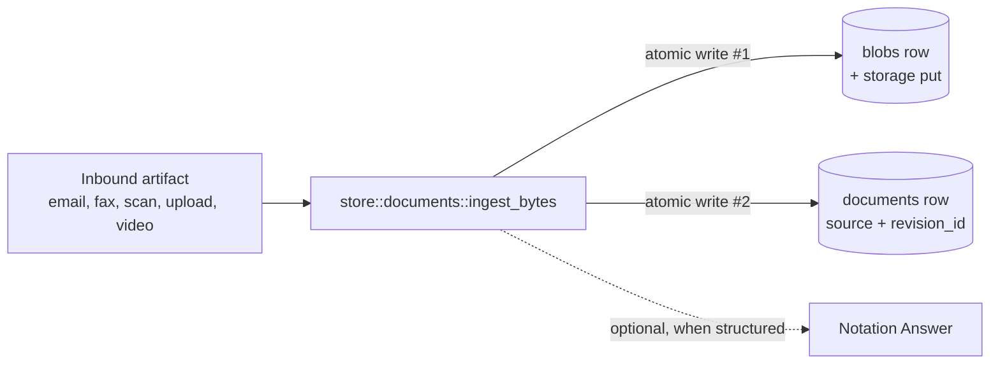

# Glossary

The vocabulary used across the Neon Law Navigator workspace. Most of these nouns are also table names in
[`store`](../store/src/entity/) — the definitions below cite the canonical SeaORM entity where one exists, so a reader
can jump straight from term to schema.

This glossary is a single alphabetical list. The notation-system vocabulary (Template, Notation, Questionnaire,
Question, Answer, Rule) lives in its own teaching-ordered doc, [`notation.md`](notation.md).

For task-oriented navigation, start at [`index.md`](index.md). Its glossary quick links map the most common terms to the
docs that explain how those terms behave in code, operations, and workflows.

---

## Actor Class

Who advances the workflow out of a given State:

- **system** — driven by a background step (e.g. rendering, sending an email). **staff** — a Neon Law Navigator operator
  must take action. **respondent** — the client must take action (e.g. sign).

See [`workflows::step::step_kind_for`](../workflows/src/step.rs).

## Address

A postal address attached to exactly one of a Person or an Entity (XOR, enforced by the application).

- Schema: [`store::entity::address`](../store/src/entity/address.rs)

## AIDA

The workspace's **domain agent persona**. AIDA exposes the same tool catalog through two protocol surfaces — A2A and MCP
— so clients across the ecosystem can drive Neon Law Navigator's workflows without caring which underlying LLM does the
routing.

- **A2A** (Agent2Agent) — public agent card at [`/api/aida.json`](https://www.your-domain.example/api/aida.json),
  JSON-RPC at `/api/aida/rpc`. Used by Gemini Enterprise and any other A2A-compatible orchestrator. A free-form
  `message/send` is interpreted by a pluggable [`AgentRouter`](../web/src/agent_router.rs) (Vertex AI Gemini Flash in
  prod) that maps the user's text to one of the declared tools.
- **MCP** — JSON-RPC at `/mcp`. Used by Claude.ai Connectors, Claude Code, LibreChat, and other Anthropic-stack
  clients. The MCP-side LLM (e.g. Claude) does its own tool routing client-side; our server just dispatches the named
  tool.

AIDA is **LLM-agnostic** by design — the router behind A2A is one implementation of a trait that could be swapped for
Claude (direct or via Vertex AI Model Garden), a local model, or even a rules engine without touching the tool catalog
or the A2A wire format.

Skill names are mirrored across both protocols by [`mcp::tools::list_tools()`](../mcp/src/tools/mod.rs): MCP clients see
them prefixed with `aida_` (`aida_create_person`); A2A clients see the unprefixed form (`create_person`) since AIDA
herself is the namespace.

- Card builder: [`web::a2a`](../web/src/a2a.rs) Router trait: [`web::agent_router`](../web/src/agent_router.rs) Tool
  registry: [`mcp::tools`](../mcp/src/tools/mod.rs)

## Blob

An opaque byte reference — content type, byte size, SHA-256, and the storage key returned by
[`cloud::StorageService`](../cloud/). The bytes themselves live in object storage (filesystem in dev, GCS in prod); this
row holds only the metadata.

- Schema: [`store::entity::blob`](../store/src/entity/blob.rs)

## Brand

Which of the two surfaces (`NEON_LAW` or `NEON_LAW_FOUNDATION`) a given route serves. The same `web` binary handles both
— see the brand table in [`README.md`](../README.md).

## Conflict-Check Graph

The in-memory graph the firm walks **before opening a matter** to decide whether the new engagement would conflict with
a client it already serves. Every node is a [Person](#person) or an [Entity](#entity); every edge is a typed
relationship between two of them.

Postgres stays the source of truth — the graph is a *transient view*, never a store. `store::conflicts::build_graph`
loads two row sources into a [petgraph](https://docs.rs/petgraph) graph per check:

- `person_entity_roles` — structural ties (manages / owns / member-of), always full confidence.
- [`relationship_edges`](#relationship-edge) — the supplemental typed edges this feature adds: adversity, related-party,
  and edges an LLM later parses out of a [Relationship Log](#relationship-log)'s free-form detail.

A check anchors on the proposed client and entity, walks up to three hops, and surfaces every distinct firm-served party
it reaches. Findings are **advisory to clear, authoritative to block**: a confident, direct `adverse_to` link to a
current client hard-stops the open; softer entanglements (a shared entity, a recorded [Disclosure](#disclosure)) are
flagged for authorized staff to acknowledge — recorded to the [Relationship Log](#relationship-log) when they do. The
graph can *raise* a conflict; only a person can *clear* one, because it is never assumed complete.

It runs on every create path (portal, [AIDA](#aida) MCP tool, CLI); the non-interactive paths have no acknowledgment
seam, so any finding refuses the open and routes staff to the portal.

- Engine: [`store::conflicts`](../store/src/conflicts.rs)
- Why not Apache AGE / Neo4j: Cloud SQL forbids the AGE extension, and a firm's whole graph fits in memory — a second
  graph datastore would be a sync liability, not a win. See [multi-cloud](multi-cloud.md).

## Council

A **group of experts** the workspace convenes for a structured, twelve-voice review — spelled c-o-u-n-c-i-l.

Neon Law Navigator runs three, the same shape with a different bench:

- The **Engineering Council** (the "Council of Twelve") — twelve practitioner-engineer voices for architecture
  decisions, design planning, and cross-cutting refactors.
- The **Legal Council** — twelve lawyer voices for legal-drafting copy review, before copy becomes a
  [Notation](notation.md#notation). Exposed to external agents as the `aida_spawn_legal_council` MCP tool.
- The **Client Council** — twelve client-side voices for intake, portal UX, pricing, onboarding, and other decisions
  where the question is whether a real person walks in and stays.

The Legal Council is **a council of [counsels](#counsel)** — a council (the group) whose members are counsels (the
attorneys). Both spellings are load-bearing; see [Counsel](#counsel).

See [`agent-decision-councils.md`](agent-decision-councils.md) for the shared protocol.

## Counsel

An **attorney** — spelled c-o-u-n-s-e-l. The members of the [Legal Council](#council) are counsels; "ethics counsel,"
"Senior Counsel," "trial counsel," and the `co_counsel` [Participation](#participation) value all use this spelling.
Distinct from [Council](#council) (c-o-u-n-c-i-l), which is the *group*: the Legal Council is a council of counsels.
[AIDA](#aida) is the agent that carries the Legal Council tool — it is neither a counsel nor the name of the council.

## Coverage Finding

One assessment of whether an [Inquiry](#inquiry) has been answered during a Live Inquiry Session. A finding may be
model-authored or staff-authored, and it cites transcript evidence; it is not a confirmed [Answer](notation.md#answer)
until staff turns it into one.

- Design: [`live-inquiry-coverage.md`](live-inquiry-coverage.md)

## Credential

A Person's licensure in a Jurisdiction — pairs a Person with a Jurisdiction and a state-issued `license_number`. The
pair `(person, jurisdiction)` is unique so the same attorney can't be double-listed under one jurisdiction.

- Schema: [`store::entity::credential`](../store/src/entity/credential.rs)

## `ctx.run`

The journaled **side-effect primitive**. Wraps any non-deterministic operation — a Postgres `INSERT`, an outbound HTTP
call, reading the wall clock — so its result is recorded in the invocation journal the first time and **reused from the
cache on replay** instead of re-executed.

```rust
// workflows-service::notation_service::questionnaire_signal
ctx.run(|| async move {
    let recorded_at = chrono::Utc::now().to_rfc3339();
    append_event(db.as_ref(), TransitionRecord { … })
        .await
        .map(|_| ())
        .map_err(|e| HandlerError::from(TerminalError::new(format!("journal: {e}"))))
})
.name("append-questionnaire-event")
.await?;
```

What this buys, concretely:

- **No double-writes on crash.** If the worker dies after the `INSERT` commits but before the handler returns, Restate
  replays the handler from the journal. The replay hits this `ctx.run`, sees a cached result, **skips the `INSERT`
  entirely**, and returns the original value.
- **Idempotent in spite of retries.** Restate retries failed invocations until they terminate. Without `ctx.run`, every
  retry would re-run the side effect; with it, only the first attempt that committed a journal entry actually runs.
- **The stable identifier matters.** `.name("append-…")` is how Restate matches a journal entry to a `ctx.run` site
  across handler versions. Rename it and a replay loses the cache hit.

If the handler does **not** wrap a side effect in `ctx.run`, the side effect runs once per replay — that's the
"double-row in `notation_events`" failure mode the design carefully avoids.

## Data Export

A snapshot of one or more Postgres tables, written to Parquet (and eventually Iceberg metadata) on a dedicated GCS
bucket, consumed by BigQuery via BigLake external tables. The [`archives`](../archives/) crate owns the writer, exposed
as the `Archives` Restate workflow hosted by the `workflows-service` worker (all workflows live there). The
[`cron-archives-trigger.yaml`](../examples/deploy/k8s/exports/cron-archives-trigger.yaml) CronJob fires nightly at 02:00
Pacific to start one invocation; the workflow runs the snapshot (and, when configured, a GCP cost-by-service summary
written as the `gcp_cost` table) as durable steps, then emails a diagnostic summary (snapshot outcomes, cost summary,
BigQuery query template, Restate invocation link) to `ARCHIVES_NOTIFY_EMAIL`.

Disambiguates from the deploy **source export** — that ships git bundles of HEAD to `gs://YOUR_PROJECT_ID-source/` for
repo distribution. Two buckets, two flavors of "export," one shared word.

- Crate: [`archives/`](../archives/) Bucket: `gs://YOUR_PROJECT_ID-exports/iceberg/<table>/`

## `devx`

The **developer-environment orchestration** for this workspace, part of the `navigator` CLI (the `cli` crate),
implemented in the [`cli/src/devx/`](../cli/src/devx/) module — there is no longer a separate `devx` crate or binary.
Brings a complete dependency stack up inside a local KIND cluster — Postgres, fake-gcs-server, Keycloak, Restate
(operator-managed), OPA, plus the `workflows-service` Restate worker — opens host port-forwards, and writes `.devx/env`
with the connection details the host-side `cargo run -p web` needs to talk to it all.

```bash
cargo run --release -p cli -- start-dev-server      # bring it all up
set -a; source .devx/env; set +a       # connection env vars
cargo run -p web                       # host-side web on :3001
cargo run --release -p cli -- down    # tear it all down
```

Subcommands:

- `up` — KIND + nginx-ingress + Restate Operator + every dep + workflows-service + port-forwards + env file. Web is left
  for the host to run.
- `down` — kill port-forwards and delete the KIND cluster. `env`, `status` — print the env file / show whether
  port-forwards are alive. `kind-up`, `kind-down` — just the cluster + ingress + Operator (no application manifests).
  `deploy` — full in-cluster stack including `navigator-web`. Idempotently sets the cluster up, **pulls** both published
  ghcr images (`NAVIGATOR_IMAGE_TAG` or the latest `YY.M.D`), retags them to `:dev`, `kind load`s, applies every
  manifest, waits for the navigator-web rollout. CI builds the images; the local loop no longer builds them.
- `undeploy` — `kubectl delete namespace navigator`. `worktree-env up/down/status` — stand up (or tear down) a
  per-worktree dev environment (its own `navigator_<slug>` database + host `web` port on the shared deps; `--demo` for
  the full in-cluster stack from ghcr), wired into Codex's Setup/Cleanup scripts. `e2e` — smoke-test the deployed stack
  (rollouts, `/health`, OPA decisions, seed counts). `grant-staff` — pre-seed the Staff demo user with the `staff` role
  for the browser e2e. `ship` — one-shot roll to prod (pin both deployments to a named `--tag`, re-register). `logs` —
  tail navigator-web logs.

The workspace has no Makefile — the `navigator` CLI is the only entry point.

## Disclosure

A formal disclosure attached to an Entity or a Project (conflicts, related-party, etc.). A `conflict` / `related_party`
disclosure on an entity is read by the [Conflict-Check Graph](#conflict-check-graph) and surfaced as a review-level
finding when a new matter reaches that entity.

- Schema: [`store::entity::disclosure`](../store/src/entity/disclosure.rs)

## Document

A named, project-scoped reference to a [Blob](#blob) — the metadata callers see (filename, kind) alongside the storage
handle.

> **Source of truth = the Blob (Model B).** When the application generates or proxies a document (a rendered retainer
  PDF, a raw inbound email body), the bytes land in object storage via [`cloud::StorageService`](../cloud/) and the
  `documents` + `blobs` rows are the canonical record. A planned sync writes a mirror copy into the Project's archive
  folder so the lawyer's "open the matter" view stays complete — but the Blob, not the archive copy, is the row the
  schema, the audit trail, and the application's read path point at.

- Schema: [`store::entity::document`](../store/src/entity/document.rs)

## Durable execution

The property the [Workflow Runtime](#workflow-runtime) gives the application. Once a Notation has emitted a signal (say,
`retainer_rendered`), the transition is recorded somewhere that survives process restarts; replay reaches the same
terminal state even if the worker crashes mid-flight. [Restate](#restate) provides this property in production;
`InMemoryRuntime` is a non-durable simulation for tests and local dev.

## Engagement / Retainer

Client-English synonym for **[Notation](notation.md#notation) bound to a Project**. An Engagement is what the firm
sells; under the hood, running an Engagement means creating a Notation, walking its Questionnaire, advancing its
Workflow, and rendering its document.

A **Retainer** is the same idea, narrowed: an Engagement whose bound Template is one of the product or shared retainer
templates (`onboarding__retainer`, `onboarding__retainer_nest`, etc.). The `web::retainer_walk` walker, the
[`docs/retainer_intake.md`](retainer_intake.md) state machine, and the firm's "signed retainer" disclaimer all refer to
that specific kind of Notation.

The schema noun in both cases is `Notation`. Marketing copy
([`web/content/marketing/litigation.md`](../web/content/marketing/litigation.md),
[`mission.md`](../web/content/marketing/mission.md)) speaks Engagement and Retainer because clients do; the database and
the workflow runtime speak Notation.

## Entity

A legal organization — an LLC, trust, corporation, foundation, etc. Has a name, an [Entity Type](#entity-type), and a
[Jurisdiction](#jurisdiction) it is organized under.

- Schema: [`store::entity::entity`](../store/src/entity/entity.rs) Lives in: `entities` table

## Entity Billing Profile

One billing profile per Entity — billing email plus a billing address. Invoices belong to an Entity Billing Profile, not
directly to an Entity, so billing can be retargeted without touching the Entity row.

- Schema: [`store::entity::entity_billing_profile`](../store/src/entity/entity_billing_profile.rs)

## Entity Type

The kind of legal Entity (`LLC`, `Trust`, `Corporation`, `Foundation`, …). Reference data, seeded from
[`store/seeds/EntityType.yaml`](../store/seeds/EntityType.yaml).

- Schema: [`store::entity::entity_type`](../store/src/entity/entity_type.rs)

## Ingestion

One inbound artifact landing on a [Project](#project) — an email attachment, a scanned letter, an upload from a client,
a fax, a client-supplied video. Each Ingestion lands **exactly one new `documents` row** carrying the channel name
(`source`), the upstream artifact's revision id (`source_revision_id`), and the channel's `received_at` timestamp; the
1:1 mapping between a `documents` row and the upstream revision id is the matter's audit trail.



Inbound channels share one entry point — `store::documents::ingest_bytes` — so bytes + documents-row write happen in one
transaction. Per-channel data (email headers, fax metadata) belongs in per-channel tables (`inbound_emails`,
`inbound_faxes`) when those channels ship.

- Schema: [`store::entity::document`](../store/src/entity/document.rs) Lives in: `documents` table

## Inquiry

One thing a transcript-bearing session should answer. By default, an Inquiry is the normalized live-coverage projection
of a Template Question: the markdown Template declares the `questionnaire:`, the LSP/CLI validate it, and the Live
Inquiry Session tracks whether the transcript answered it. The term is broader than [Question](notation.md#question)
because deposition outline items, witness-prep prompts, and intake checklist items can also be Inquiries. An ordered
group of Inquiries is an **Inquiry Set**.

Use Inquiry rather than "interrogatory" for the generic product noun: an interrogatory is already a formal written
discovery device in litigation.

- Design: [`live-inquiry-coverage.md`](live-inquiry-coverage.md)

## Invoice

One billable invoice owned by an Entity Billing Profile. Status is `draft`, `issued`, `paid`, or `void`. Totals are
stored in minor units (cents) to avoid float-math hazards.

- Schema: [`store::entity::invoice`](../store/src/entity/invoice.rs)

## Invoice Line Item

One billable line on an Invoice — description, quantity, and unit price in cents.

- Schema: [`store::entity::invoice_line_item`](../store/src/entity/invoice_line_item.rs)

## Jurisdiction

A US state, federal jurisdiction, or foreign jurisdiction that an Entity can be organized under, or that a
[Credential](#credential) is issued by. Identified by short code (`NV`, `CA`, `US`, …).

- Schema: [`store::entity::jurisdiction`](../store/src/entity/jurisdiction.rs) Seed:
  [`store/seeds/Jurisdiction.yaml`](../store/seeds/Jurisdiction.yaml)

## Letter

One physical piece of mail, incoming or outgoing, scoped to a Mailroom.

- Schema: [`store::entity::letter`](../store/src/entity/letter.rs)

## Live Inquiry Session

One Project-scoped, transcript-bearing event — for example a Northstar sitting, deposition, witness interview, or client
intake call — evaluated against an [Inquiry](#inquiry) Set while the transcript develops. Transcript segments persist
immediately, speaker labels are provisional until mapped to a [Person](#person), and Coverage Findings remain proposed
until staff confirms them.

- Design: [`live-inquiry-coverage.md`](live-inquiry-coverage.md)

## Mailroom

A physical mail-receiving destination — an Address with a name. Letters land here.

- Schema: [`store::entity::mailroom`](../store/src/entity/mailroom.rs)

## Matter

Client-English synonym for **[Project](#project)**. The same row, under the noun a lawyer or a client uses out loud.
*"Open a matter"* and *"open a Project"* describe the same insert into the `projects` table; the marketing surface picks
one, the schema picks the other.

## Neon Law Navigator

Short for **Neon Law Navigator** — the product name and the umbrella over this workspace: the CLI (`navigator`), the
public website (`web`), the rule engine (`rules`), the MCP server, and everything else under this Cargo workspace.
Published as open source by the [Neon Law Foundation](#neon-law-foundation-nlf) under a dual **Apache-2.0 / MIT**
license (at your option) and run in production by **Neon Law**, the law firm. The *code* is licensed; the *name and
marks* — "Neon Law", "Neon Law Foundation", "NLF", "Navigator", "Neon Law Navigator", and the NLF logo — are reserved.
"Neon Law" is a registered trademark of **Shook Law PLLC** (the firm trading as Neon Law), U.S. Reg. No. 6,325,650. See
the [Trademarks note in `README.md`](../README.md#trademarks); fork under your own name via the `navigator rebrand`
white-label seam.

## Neon Law Foundation (NLF)

The 501(c)(3) nonprofit half of the two-organization structure — **Neon Law** is the law firm, the **Neon Law Foundation
(NLF)** runs the access-to-justice programs and **publishes Neon Law Navigator as open source**. "NLF" is the
abbreviation used across code comments and brand assets (e.g. the NLF PNG mark) for the Foundation. See
[`mission.md`](../web/content/marketing/mission.md) and the Foundation brand in [`views::brand`](../views/src/brand.rs).

## Notation Event

One immutable journal row for a [Notation](notation.md#notation)'s state machine. Each row records the fact that a given
pair `(notation_id, machine_kind)` moved from one state to another via some condition, plus an optional opaque JSON
payload (the respondent's answer for questionnaire signals; `None` for workflow signals). The durable runtime appends
these so replay is deterministic, and the "current state" of a pair is the `to_state` of its latest row.

The on-disk shape mirrors the runtime type [`workflows::runtime::WorkflowEvent`](../workflows/src/runtime.rs); both
layers stay in sync because the worker writes them through `ctx.run`.

- Schema: [`store::entity::notation_event`](../store/src/entity/notation_event.rs) Lives in: `notation_events` table

## Participation

The `person_project_roles.participation` column — the matter-side role a Person plays on a specific Project. Distinct
from the system-wide [Person](#person) tier (`role`): a `staff` paralegal can hold a `client` participation on their own
personal matter. The vocabulary is open and grows with the firm's practice areas; no DB-level constraint.

Not to be confused with [Disclosure](#disclosure), which is the firm's conflicts log, not an access grant.

- See [`docs/access-model.md`](access-model.md) for the full role + participation model.

## Person

A human contact. The system-wide tier — `client`, `staff`, or `admin` — lives on this row in the `role` column, not on
the OIDC token. The Keycloak / Google id_token carries only `sub` and `email`; the callback handler links that pair to a
Person via `oidc_subject` and reads `role` from the DB. See [`docs/access-model.md`](access-model.md) and
[`docs/oidc.md`](oidc.md).

- Schema: [`store::entity::person`](../store/src/entity/person.rs) Lives in: `persons` table

## Person–Entity Role

A Person's role within an Entity (e.g. `manager`, `member`, `beneficiary`, `trustee`).

- Schema: [`store::entity::person_entity_role`](../store/src/entity/person_entity_role.rs)

## Person–Project Role

A Person's participation on a Project. The `participation` column holds the matter-side role (`attorney`, `paralegal`,
`client`, `co_counsel`); the row's presence is what gates project visibility for `client` and `staff` tiers. See
[`docs/access-model.md`](access-model.md).

- Schema: [`store::entity::person_project_role`](../store/src/entity/person_project_role.rs)

## Directly Responsible Individual (DRI)

The natural [Person](#person) accountable for a [Matter](#matter) — the one name to ask "where does this stand?". Every
matter carries **two** DRIs, designated at matter-open:

- **Staff DRI** — the attorney/admin accountable for the matter inside the firm. The opening staffer by default (else
  the firm principal, resolved by role).
- **Client DRI** — the one **client-side** person accountable for the matter. Must be a real, pre-existing
  [Person](#person) with `role = client` (never a firm attorney — a matter's client of record is a client). The client
  field exists before the project; the matter is opened *for* that client.

Both are **first-class, `NOT NULL` foreign-key columns** on the project row (`projects.staff_dri_person_id`,
`projects.client_dri_person_id`) — a required, exactly-one-per-side attribute. This is **distinct from** the
[Person–Project Role](#person–project-role) participation ledger, which records broader, many-per-matter
involvement/access (e.g. the client also gets a `client` participation for portal visibility). The DRI columns are the
source of truth for "who owns this?"; participation answers "who's involved and what can they see?".

A matter is opened against a pre-existing [Entity](#entity), **for** a pre-existing client, **and** always on a
[retainer](#engagement--retainer) — a project is not official until a retainer exists. The matter-open service validates
the entity and the client role before any row is created.

- Schema: [`store::entity::project`](../store/src/entity/project.rs) (the `staff_dri_person_id` / `client_dri_person_id`
  columns)

## Project

A **[Matter](#matter)** in client English. The durable container every [Notation](notation.md#notation) lives in. Has a
`status` (`open`, `closed`, `archived`) and is **always opened against an [Entity](#entity)** — a legal organization, or
a `Human` entity for a solo natural person. The `entity_id` FK is `NOT NULL`: a matter without an entity is a bug.

**Every Notation belongs to exactly one Project.** The schema enforces this with a `NOT NULL` `project_id` FK on
`notations`. A Notation without a Project is a bug.

**Every Project is an append-only git repository**, served Rust-native from `web` at `/projects/<id>.git`, gated by a
`web`-minted Personal Access Token plus the project ACL, with Git LFS objects in object storage. A lawyer's "open the
matter" gesture clones or browses that repo; the matter's history is tamper-evident and append-only by construction. See
[`docs/git-project-repos.md`](git-project-repos.md).

Object-storage artifacts (rendered PDFs, signed documents, generated exports) live in
`gs://YOUR_PROJECT_ID-assets/projects/{id}/` for machine reads, and the nightly Postgres→Parquet snapshots are immutable
objects in GCS — so deleting a Project's database rows never deletes its archives. Google Drive has been fully removed
(the legacy `drive_folder_id` column, the `DriveSync` workflow, and the `cli drive` OAuth door are all gone); the
per-Project git repository is the document system of record.

- Schema: [`store::entity::project`](../store/src/entity/project.rs)

## Purchasing Power Parity (PPP)

The country-indexed pricing applied to [Northstar](../web/content/marketing/northstar.md) — and the **only** Neon Law
service that carries it. Every other service is flat-fee: one price for everyone. Northstar is the exception because
everyone should be able to plan for life after death, not only the wealthy.

PPP restates a price in terms of what money actually buys locally: a fee that takes the same share of a person's
purchasing power in Lagos as in Las Vegas, rather than the same number of nominal dollars. To set a Northstar fee we
index the $3,333 anchor to a published PPP conversion factor for the client's country.

Hard standards we can cite to source the factor, in descending order of rigor:

- **World Bank International Comparison Program (ICP)** — the authoritative *PPP conversion factor (LCU per
  international $)*, indicator `PA.NUS.PPP`, refreshed on the ICP benchmark cycle. The default source.
- **IMF World Economic Outlook** — *Implied PPP conversion rate*, published twice a year; useful for the years between
  ICP benchmarks.
- **OECD PPPs and exchange rates** — finer-grained PPPs for OECD / EU member economies. **Penn World Table** (Groningen
  Growth and Development Centre) — research-grade PPP time series for longitudinal work. **The Economist's Big Mac
  Index** — informal single-good sanity check only; never the basis of a quoted fee.

The published factor and benchmark year behind any given fee are recorded in the engagement letter, so the adjustment is
auditable rather than discretionary.

## Referral

A [Matter](#matter) the firm hears out but does not take on, handed instead to outside counsel whose practice fits it.
The firm's practice is flat-fee, document-driven work — company formation, governing documents, state and court filings;
contested courtroom work (litigation, appeals, contested hearings) is referred out. A Referral is **client-English, not
a schema noun** — like [Matter](#matter) and [Engagement / Retainer](#engagement--retainer), it names a thing a lawyer
says out loud, not a table. There is no `referrals` table: a Matter is the same row as a [Project](#project) in the
database, and a referred Matter is simply one the firm closes (or never opens) after pointing the client to trial
counsel. The marketing surface is [`litigation.md`](../web/content/marketing/litigation.md) (`/services/litigation`);
the firm-footer "every legal matter is different, and past results do not guarantee a similar result" disclaimer
([`views/src/brand.rs`](../views/src/brand.rs)) covers transactional and referred matters alike.

## Relationship Edge

A typed graph edge with a [Person](#person) or [Entity](#entity) on **each** end — the canonical two-sided relationship
the [Conflict-Check Graph](#conflict-check-graph) traverses. Distinct from the [Relationship Log](#relationship-log),
which is a one-sided audit trail (one actor, one subject); a Relationship Edge instead asserts "A is `adverse_to` B" or
"A is a `related_party` of B."

Each edge carries provenance (`source_kind` ∈ `manual` / `disclosure` / `relationship_log` / `llm`) and a
`confidence_pct` (0–100). Human-asserted edges are full confidence; edges an LLM parses out of a Relationship Log's
free-form detail land lower, and the conflict check multiplies confidence along a path so a chain of weak guesses cannot
raise a finding on its own.

- Schema: [`store::entity::relationship_edge`](../store/src/entity/relationship_edge.rs)

## Relationship Log

Append-only audit trail of relationship changes — entries like `person joined entity` or `project closed`. The source of
truth for "what changed when" outside of normal table rows.

It is **not** the [Conflict-Check Graph](#conflict-check-graph): a Relationship Log row is one-sided (an actor acted on
a subject), whereas the graph's edges are two-sided [Relationship Edges](#relationship-edge). The log *feeds* the graph
— an LLM can parse a row's free-form detail into typed edges — and the graph writes back to the log when staff
acknowledge a conflict override.

- Schema: [`store::entity::relationship_log`](../store/src/entity/relationship_log.rs)

## Repository

An external git repository the CLI's `navigator import` reads notation content from. The `git_repositories` row holds
the URL hash and last imported commit SHA so re-imports are idempotent. One row per external source, shared across
Projects.

This is the *external imports* flavor — used by the CLI to pull template content into the workspace. It is **distinct
from** the per-Project document repository (the append-only git repo served by `web` that *is* a matter's document
store, see [Project](#project) and [`git-project-repos.md`](git-project-repos.md)): the `git_repositories` table tracks
outside sources the workspace reads notation *from*, not the matter repos the workspace itself hosts.

- Schema: [`store::entity::git_repository`](../store/src/entity/git_repository.rs)

## Restate

The **durable execution layer** in production — [restate.dev](https://restate.dev). An open-source workflow orchestrator
that records each `signal` as a durable side effect, so a worker that crashes mid-flight can replay to the same terminal
state. Restate is the production target for [Workflow Runtime](#workflow-runtime); locally,
[`k8s/overlays/kind/deps/restate.yaml`](../k8s/overlays/kind/deps/restate.yaml) brings up a broker in KIND.

Crucially, **Restate executes the declared workflow verbatim.** The Template's `workflow:` block is the spec; Restate is
the engine. Neither layer needs to know about the other beyond the YAML contract.

## Restate context (`ctx`)

The handle Restate passes into every handler invocation. Carries the durable **journal** for this invocation, the
**keyed state** for the virtual object the call landed on, and the primitives the handler uses to interact with Restate
(`ctx.get`, `ctx.set`, `ctx.run`, `ctx.sleep`, …). Each handler in
[`workflows-service::notation_service`](../workflows-service/src/notation_service.rs) takes a `ctx: ObjectContext<'_>`
(or `SharedObjectContext<'_>` for read-only handlers); that's how the worker reads the stored spec yaml, advances state,
and records side effects atomically with respect to replay.

> **Mental model.** `ctx` is to a Restate handler what a database *transaction handle* is to a SeaORM helper — every
  durable thing the handler does flows through it, and the framework treats the sequence of `ctx` calls as the unit of
  replay.

## Role

The **system-wide authorization tier** a [Person](#person) carries in `persons.role`. There are exactly four tiers and a
person holds exactly one:

- **Anonymous** — not signed in; no `persons` row at all. The public visitor, who sees only public pages. **Client** — a
  person the firm represents on at least one matter. Sees only Projects with a matching `person_project_roles` row.
- **Staff** — a firm employee. Same per-Project visibility scope as `client`; the tier difference is in what they may
  *do* on a visible Project (edit, sign, file), not in what is visible.
- **Admin** — a firm employee with system-administration authority. Bypasses Project-scoping entirely and sees every
  Project.

`role` is read from the DB row at callback time, never trusted from the OIDC token. Sign-up is operator-mediated: an
unseeded identity is rejected, not created. The one exception is the operator's configured admin email, created on first
login as an ordinary `admin` — there is no separate "super" tier.

- Schema: [`store::entity::person::Role`](../store/src/entity/person.rs) — stored `TEXT` with
  `CHECK (role IN ('client','staff','admin'))`; Anonymous is the absence of a row.
- See [`docs/access-model.md`](access-model.md) for the full role + [Participation](#participation) model.

## Share Issuance

One row per issuance event — Entity X issued N shares of `<class>` to `<holder>` on `<date>`. The cap-table admin view
aggregates by `holder_name` to compute ownership breakdowns.

- Schema: [`store::entity::share_issuance`](../store/src/entity/share_issuance.rs)

## Signature Block

A `{{ signer.field }}` placeholder in a Template body that becomes an e-signature field on the rendered document. The
*dot* is what separates it from an ordinary data placeholder like `{{client_name}}` (no dot, string-substituted with a
questionnaire answer): a signature block is **not** filled with a value — it expands to a visible signature line plus an
invisible anchor token in the PDF text layer that the e-signature provider keys its field off of.

The `signer` is a **role**, never a person's name (`{{firm.signature}}`, not `{{nick.signature}}`) — it resolves to a
real [Person](#person) (the respondent, or the attorney of record) when the [Notation](notation.md#notation) runs. The
`field` is the field type: `signature`, `initials`, or `date`. Validity is enforced by rule **N107**
([`rules::f107`](../rules/src/f107.rs)): the signer and field must be known, and a Template that draws any signature
block must declare a `sent_for_signature` (or `sent_for_signature__*`) [State](#state) to collect the signature.

## State

One named position in a questionnaire or workflow machine. Notation rows carry the current state as a string. State
names use the `<prefix>__<discriminator>` form so the runtime can pick the right [Actor Class](#actor-class) per state.
A **workflow** state's prefix is a step from the workflow-step catalog (`staff_review`, `sent_for_signature`); a
**questionnaire** state's prefix is a [Question Type](#question-type) and its discriminator is the role
(`entity__company`), so two answers of one type stay distinct.

## Question Type

The `<type>` half of a questionnaire [State](#state) name (`<type>__<role>`) — a closed set defined by
[`store::question_registry::QuestionType`](../store/src/question_registry.rs). Each type is a **record** (creates or
links a `store::entity` row — `person`, `entity`, `address`, …), a **reference** (selects a seeded row — `jurisdiction`,
`product`, …), or a **custom** primitive (`custom_text`, `custom_single_choice`, `custom_datetime`, …). Record and
reference types pair a singular with an explicit plural/aggregate (`person`→`people`). `N113` grounds every typed state
to this registry, `N114` orders `__for_` children after their parent, `N115` resolves body paths and iterators against
the declared states, `N117` requires every `custom_text__*` role to be an allowlisted free-text primitive (glossary
nouns — names, emails, countries, phone numbers — can never be allowlisted), and `N118` requires the block to be one
linear `_` chain from `BEGIN` to `END` (the walker's only signal). Use the glossary model and its dotted fields —
`person__client` plus `{{person__client.email}}` — before reaching for a custom primitive. See
[`notation-authoring.md`](notation-authoring.md).

## Analysis

The workflow prefix `analysis` is a system wait state for review-in matters: the web app performs the contract analysis,
persists the findings, and signals the workflow when `analysis_ready` is available. See
[`notation-authoring.md`](notation-authoring.md#changing-the-workflow-composition) and
[`workflows::step::STEP_PREFIXES`](../workflows/src/step.rs).

## Certified Mail

The workflow prefix `certified_mail` records a staff-driven outbound certified-mail submission. It is an outbound
submission step and must sit behind [Staff Review](#staff-review). See
[`notation-authoring.md`](notation-authoring.md#changing-the-workflow-composition) and
[`workflows::step::STEP_PREFIXES`](../workflows/src/step.rs).

## Client Review

The workflow prefix `client_review` lets the respondent review and approve attorney-approved drafts before a later
signature or closing step. See [`notation-authoring.md`](notation-authoring.md#changing-the-workflow-composition) and
[`workflows::step::STEP_PREFIXES`](../workflows/src/step.rs).

## Document Drafts

The workflow prefix `document_drafts` is a system wait state for web-rendered review-document rows, used by workflows
that generate multiple client-reviewable instruments. See
[`notation-authoring.md`](notation-authoring.md#changing-the-workflow-composition) and
[`workflows::step::STEP_PREFIXES`](../workflows/src/step.rs).

## Document Intake

The workflow prefix `document_intake` files an inbound artifact, such as a transcript or executed PDF, into the matter
through the shared document-ingestion path. See
[`notation-authoring.md`](notation-authoring.md#changing-the-workflow-composition) and
[`workflows::step::STEP_PREFIXES`](../workflows/src/step.rs).

## Document Open

The workflow prefix `document_open` renders a template body into a Blob-backed document for the Project. See
[`notation-authoring.md`](notation-authoring.md#changing-the-workflow-composition) and
[`workflows::step::STEP_PREFIXES`](../workflows/src/step.rs).

## E-Filing

The workflow prefix `e_filing` records an electronic government filing. It is an outbound submission step and must sit
behind [Staff Review](#staff-review). See
[`notation-authoring.md`](notation-authoring.md#changing-the-workflow-composition) and
[`workflows::step::STEP_PREFIXES`](../workflows/src/step.rs).

## Email Send

The workflow prefix `email_send` renders and sends a bundled outbound email template through the configured email
service. See [`notation-authoring.md`](notation-authoring.md#changing-the-workflow-composition) and
[`workflows::step::STEP_PREFIXES`](../workflows/src/step.rs).

## Extract

The workflow prefix `extract` is a system wait state for structured-data extraction from a previously ingested artifact.
See [`notation-authoring.md`](notation-authoring.md#changing-the-workflow-composition) and
[`workflows::step::STEP_PREFIXES`](../workflows/src/step.rs).

## Filing

The workflow prefix `filing` records a named government filing. It is an outbound submission step and must sit behind
[Staff Review](#staff-review). See the
[`notation-authoring.md`](notation-authoring.md#changing-the-workflow-composition) guide and
[`workflows::step::STEP_PREFIXES`](../workflows/src/step.rs).

## Firm Signature

The workflow prefix `firm_signature` records a staff-side signature, usually the firm's countersignature or closing
signature. See [`notation-authoring.md`](notation-authoring.md#changing-the-workflow-composition) and
[`workflows::step::STEP_PREFIXES`](../workflows/src/step.rs).

## Intake Persisted

The workflow prefix `intake_persisted` is a system wait state after questionnaire answers have been written and before
post-intake workflow work begins. See [`retainer_intake.md`](retainer_intake.md#post-intake-workflow) and
[`workflows::step::STEP_PREFIXES`](../workflows/src/step.rs).

## Mailroom Receive

The workflow prefix `mailroom_receive` records staff receipt of physical mail. See
[`notation-authoring.md`](notation-authoring.md#changing-the-workflow-composition) and
[`workflows::step::STEP_PREFIXES`](../workflows/src/step.rs).

## Mailroom Send

The workflow prefix `mailroom_send` records staff sending physical mail. See
[`notation-authoring.md`](notation-authoring.md#changing-the-workflow-composition) and
[`workflows::step::STEP_PREFIXES`](../workflows/src/step.rs).

## Notarization

The workflow prefix `notarization` records a respondent signing or refusing in front of a notary. See
[`notation-authoring.md`](notation-authoring.md#changing-the-workflow-composition) and
[`workflows::step::STEP_PREFIXES`](../workflows/src/step.rs).

## On-Chain Record

The workflow prefix `onchain` records an attorney attestation in the durable attestation table and, when configured,
through the chain backend. See [`solana-attestation.md`](solana-attestation.md) and
[`workflows::step::STEP_PREFIXES`](../workflows/src/step.rs).

## Sent for Signature

The workflow prefix `sent_for_signature` is a system wait state for an outbound e-signature request; a provider webhook
or equivalent signal advances it. See [`docusign-esignature.md`](docusign-esignature.md) and
[`workflows::step::STEP_PREFIXES`](../workflows/src/step.rs).

## Signature

The workflow suffix family `_signature` / `_signatures`, plus the `witnesses` prefix, records respondent-side signing.
See [`notation-authoring.md`](notation-authoring.md#changing-the-workflow-composition) and
[`workflows::step::STEP_PREFIXES`](../workflows/src/step.rs).

## Staff Review

The workflow prefix `staff_review` is the mandatory human attorney/staff gate before a document is sent for binding
signature, certified mail, e-filing, or another outbound submission. See
[`notation-authoring.md`](notation-authoring.md#changing-the-workflow-composition),
[`workflows::guardrail`](../workflows/src/guardrail.rs), and
[`workflows::step::STEP_PREFIXES`](../workflows/src/step.rs).

## Witnesses

The workflow prefix `witnesses` records respondent-side witness signatures and resolves through the same Signature step
kind as `_signature` / `_signatures`. See
[`notation-authoring.md`](notation-authoring.md#changing-the-workflow-composition) and
[`workflows::step::STEP_PREFIXES`](../workflows/src/step.rs).

## Step

A unit of work executed by the runtime when entering a State. Today every Step is `system`-driven. The shipped workflow
is **retainer intake** — see [`docs/retainer_intake.md`](retainer_intake.md).

## Transition

One edge between States, fired by an event (e.g. `retainer_rendered`, `signature_received`).

## Transcript Segment

One append-only chunk of text captured during a [Live Inquiry Session](#live-inquiry-session). A segment may carry a
provider speaker label such as `speaker_1`, but that label is not identity; staff can later map it to a Person or
session role before confirming an Answer.

- Design: [`live-inquiry-coverage.md`](live-inquiry-coverage.md)

## Workflow

The state machine that drives a [Notation](notation.md#notation) from initial submission to final disposition. Two
layers share the name:

- **The declared workflow** — what a lawyer writes in the template's `workflow:` block. Plain YAML: a set of named
  States, transitions keyed by event, a `BEGIN` and an `END`. Lives next to the questionnaire under
  [`templates/`](../templates/).
- **The executed workflow** — how the declared workflow actually runs. The [`workflows`](../workflows/) crate owns this
  layer: the [Workflow Spec](#workflow-spec) parser, the [Workflow Runtime](#workflow-runtime) trait, and the
  [Restate](#restate) adapter that drives it durably in production.

The same YAML is the contract between the two: a lawyer reads it as a flowchart; the engine reads it as a state-machine
spec. **The Template declares; Restate runs.**

## Workflow Runtime

The trait abstraction over the durable executor — [`workflows::WorkflowRuntime`](../workflows/src/runtime.rs). Two
implementations ship today:

- **`InMemoryRuntime`** — non-durable, in-process. Used by tests and by `cargo run -p web` when no Restate broker is
  configured. Reset on each process start.
- **`RestateRuntime`** — HTTP adapter that talks to a [Restate](#restate) broker. Production target. The web binary
  picks one at boot and hands it to `AdminState::workflow_runtime`.

A Workflow Runtime is started once per Notation (`start(notation_id, spec)`) and advanced by external
`signal(notation_id, spec, condition)` calls. Every transition is recorded as a [Notation Event](#notation-event) so a
crash plus replay terminates in the same state.

## Workflow Spec

The parsed form of a Template's `workflow:` block — a set of named States, transitions keyed by event, with `BEGIN` and
`END` required. Produced once at boot from the template frontmatter; reused for every Notation of that Template. See
[`workflows::spec`](../workflows/src/spec.rs).
