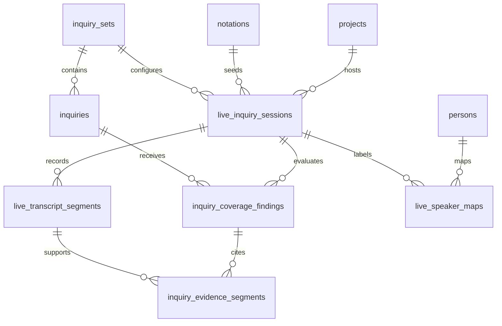

# Live Inquiry Coverage

Live Inquiry Coverage is the generic shape behind the proposed Northstar live-sitting helper. A user brings a set of
things the session must answer, Navigator listens to a transcript as it develops, and the matter page shows which items
are answered, ambiguous, or still need follow-up.

Northstar estate sittings are the first use case. The model must also fit later litigation prep, depositions, witness
interviews, intake interviews, and any other transcript-bearing matter session.

## Vocabulary

- **Inquiry** — one thing the session should answer. It is broader than a notation `Question`: a Template question can
  become an Inquiry, but a deposition outline item or intake checklist item can also be an Inquiry.
- **Inquiry Set** — an ordered group of Inquiries used for one class of session.
- **Live Inquiry Session** — one transcript-bearing event on a Project, such as a Northstar sitting or deposition.
- **Transcript Segment** — one append-only chunk of transcript text from a provider or manual capture surface.
- **Coverage Finding** — the current model/staff assessment for one Inquiry in one Live Inquiry Session.
- **Evidence Segment** — the segment reference that supports a Coverage Finding.

Avoid the generic name `Interrogatory`. In litigation, an interrogatory is already a formal written discovery device.
This feature has to cover live testimony, client interviews, and non-litigation intake too.

## Product rule

The product should maximize coverage without pretending the model is the lawyer.

```text
Transcript text can create a Coverage Finding.
Coverage Findings can suggest follow-up prompts.
Only a staff action can turn a finding into a confirmed Answer.
```

That keeps the current human-review boundary intact: machine-extracted values are visibly different from staff/client
answers until an attorney reviews them.

## Entity relationship sketch

This is a proposed table shape, not a migration in this doc PR.



Recommended tables:

| Table | Purpose |
| --- | --- |
| `inquiry_sets` | Reusable or Project-scoped checklist definition. |
| `inquiries` | Ordered items with `code`, `prompt`, `answer_type`, and optional legal/workflow metadata. |
| `live_inquiry_sessions` | One live transcript event, linked to a Project and optionally a Notation. |
| `live_transcript_segments` | Append-only transcript chunks with provider sequence ids and optional speaker labels. |
| `live_speaker_maps` | Staff mapping from provider label (`speaker_1`) to `Person` and session role. |
| `inquiry_coverage_findings` | Latest status per Inquiry, plus confidence and model/staff authorship. |
| `inquiry_evidence_segments` | Join table from findings to supporting transcript segments. |

Keep Postgres as the source of truth. This is privileged Project data that needs the same role, participation,
retention, audit, and backup story as documents, answers, review documents, and notation events.

## Suggested statuses

```rust
pub enum CoverageStatus {
    Unasked,
    AskedNotAnswered,
    LikelyAnswered,
    Answered,
    Ambiguous,
    NeedsFollowUp,
    NotApplicable,
}
```

`Answered` means "the finding believes the transcript contains an answer." It does not mean the value has become a
confirmed notation `Answer`.

## Provider abstraction

Speech-to-text is enough for transcription, but not for coverage. The app needs one seam for transcript capture and a
separate seam for coverage inference.

```rust
#[async_trait::async_trait]
pub trait LiveTranscriptProvider: Send + Sync {
    async fn start(&self, config: TranscriptConfig) -> Result<TranscriptStream, TranscriptError>;
}

#[async_trait::async_trait]
pub trait InquiryCoverageProvider: Send + Sync {
    async fn evaluate(
        &self,
        inquiry_set: InquirySetSnapshot,
        transcript_window: Vec<TranscriptSegmentSnapshot>,
    ) -> Result<Vec<CoverageFindingDraft>, CoverageError>;
}
```

For v1, prefer Google Cloud Speech-to-Text v2 for speech-to-text and a Gemini/Vertex-backed `InquiryCoverageProvider`
for coverage. Browser code should not talk to provider credentials directly:

```text
Browser WebSocket
  -> web live-session handler
  -> provider stream client
  -> append transcript segment
  -> run coverage inference
  -> push coverage update over WebSocket
```

## Speaker attribution

Provider speaker labels are useful but provisional. A speech provider can say `speaker_1`; Navigator should not assume
that label means "client" or "attorney" until staff maps it.

```rust
pub struct TranscriptSegmentDraft {
    pub session_id: Uuid,
    pub provider_sequence: i64,
    pub starts_at_ms: Option<i64>,
    pub ends_at_ms: Option<i64>,
    pub text: String,
    pub provider_speaker_label: Option<String>,
}

pub struct SpeakerMapDraft {
    pub session_id: Uuid,
    pub provider_speaker_label: String,
    pub person_id: Option<Uuid>,
    pub session_role: Option<String>, // "client", "attorney", "witness", "interpreter"
}
```

Coverage can run before speakers are mapped. Confirming a notation Answer can require the relevant evidence segment to
be mapped to the respondent or another expected role.

## Notation template integration

The generic path should work with no Template grammar change: the initial Inquiry Set can be derived from a Template's
existing `questionnaire` graph.

```yaml
questionnaire:
  BEGIN:
    _: recording_consent
  recording_consent:
    _: testator_name
  testator_name:
    _: executor_name
```

For Northstar, that means each questionnaire `Question` becomes an Inquiry for the live sitting. The Inquiry Set is
Project-scoped when staff customize it for one client, and workspace-shared when it is the default for a Template.

A later Template extension can make the mapping explicit without replacing the questionnaire:

```yaml
live_inquiry:
  mode: derive_from_questionnaire
  session_label: Northstar sitting
  answer_policy: staff_confirms
  respondent_speaker_role: client
  follow_up_style: conversational
```

For litigation or deposition work, a Template could point to a different Inquiry Set:

```yaml
live_inquiry:
  mode: inquiry_set
  inquiry_set_code: deposition__witness_background
  answer_policy: staff_confirms
  respondent_speaker_role: witness
```

## Staff flow

1. Staff opens a Project and starts a Live Inquiry Session.
2. Navigator seeds the Inquiry Set from the Notation questionnaire or a selected Inquiry Set.
3. Transcript segments persist immediately as final provider segments arrive.
4. Coverage inference runs against the latest segment window and updates Coverage Findings.
5. Staff sees follow-up prompts while the session is still live.
6. Staff maps provider speaker labels to Persons/roles when needed.
7. Staff ends the session and files the final transcript through the existing document-intake lane.
8. Staff confirms any proposed values that should become notation Answers.

## Route sketch

```rust
Router::new()
    .route(
        "/portal/projects/:id/live-inquiry-sessions",
        post(live_inquiry::start_session),
    )
    .route(
        "/portal/projects/:id/live-inquiry-sessions/:session_id/stream",
        get(live_inquiry::stream_socket),
    )
    .route(
        "/portal/projects/:id/live-inquiry-sessions/:session_id/speakers",
        post(live_inquiry::map_speaker),
    )
    .route(
        "/portal/projects/:id/live-inquiry-sessions/:session_id/confirm",
        post(live_inquiry::confirm_findings),
    );
```

Every route stays Project-scoped. Non-participants should see the same not-found behavior as other Project detail
surfaces.

## Acceptance criteria for the first implementation

- Staff can start a Live Inquiry Session from a Northstar Project.
- The session is seeded from the estate Template questionnaire.
- Final transcript segments persist immediately.
- Coverage Findings update while the browser stays on the same page.
- Findings cite transcript segment ids as evidence.
- Speaker labels can be mapped to Persons/roles after the provider emits them.
- Ending the session files the final transcript through `document_intake__transcript`.
- No Coverage Finding becomes a confirmed Answer without staff action.
- Logs and traces include identifiers, counts, statuses, and latency only; never transcript text or answer bodies.
