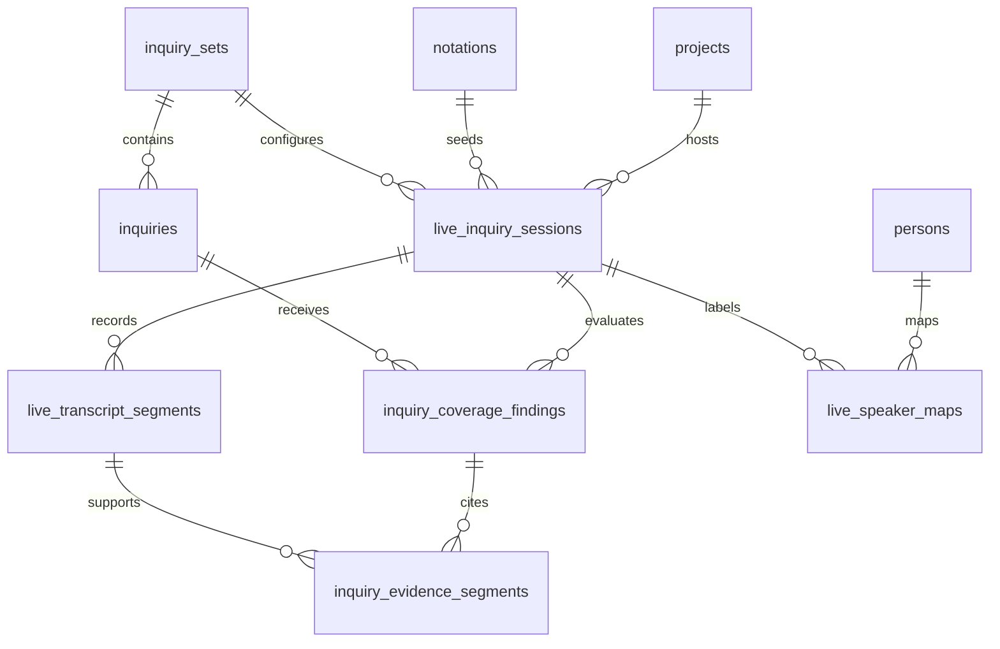

# Live Inquiry Coverage

Live Inquiry Coverage is the generic shape behind the proposed Northstar live-sitting helper. The common dock point is
the markdown Template that already creates a Notation: its frontmatter declares the `questionnaire:` and `workflow:`
graphs, the LSP/CLI validate that structure, and a running Notation binds those declarations to a Project. Live coverage
projects the Template's declared Questions into an Inquiry Set, listens to a transcript as it develops, and shows which
items are answered, ambiguous, or still need follow-up.

Northstar estate sittings are the first use case. The model must also fit later litigation prep, depositions, witness
interviews, intake interviews, and any other transcript-bearing matter session.

## Feature gating

Live transcription is **off by default and gated behind a feature flag**. The offline-first lane
([`northstar-estate-flow.md`](northstar-estate-flow.md)) remains the shipped default; live coverage is an opt-in adjunct
a deployment turns on deliberately. The flag has two layers so the speech-to-text and coverage code is not even loaded
until it is enabled:

- **Compile-time (Cargo feature `live-transcription`).** The Google Speech-to-Text / Vertex provider implementations,
  their SDK dependencies, and the WebSocket session handler compile in only under this feature. A default build of `web`
  carries none of that code or its credentials surface. This is also what keeps the workspace's GCP-isolation invariant
  intact: the provider implementations live in the `cloud` crate behind the feature, and `web` depends only on the
  `LiveTranscriptProvider` / `InquiryCoverageProvider` traits, never the GCP SDK directly
  ([`docs/multi-cloud.md`](multi-cloud.md)).
- **Runtime flag.** Even in a binary built with the feature, a per-deployment flag controls whether the routes and UI
  are exposed. A deployment that has not turned it on behaves exactly as today — offline upload only.

Because the flag also gates whether the feature exists at all, it cleanly resolves the product tension: nothing about a
default Northstar sitting changes ("the sitting's gravity is the product, not a laptop running captions") unless a
deployment explicitly opts into live coverage, and live coverage is a staff-side tool — most naturally a deposition,
witness, or intake interview — rather than captions running during a solemn estate sitting.

## Language scope

**English only for v1, by design.** The live transcript, the coverage inference, and the Inquiry prompts are all
English. This matches the workspace English-first invariant ([`docs/i18n.md`](i18n.md)): the only two sanctioned
localization surfaces are marketing pages and questionnaire intake *prompts* via `question_translations`, and neither is
a live-transcript surface. Non-English live intake (e.g. a Spanish-language interview) is explicitly out of scope for
the first implementation and would be a later, separately-designed lane — it is not a silent assumption to discover at
build time.

## Vocabulary

- **Inquiry** — one thing the session should answer. It is broader than a notation `Question`: a Template question can
  become an Inquiry, but a deposition outline item or intake checklist item can also be an Inquiry.
- **Inquiry Set** — an ordered group of Inquiries used for one class of session.
- **Live Inquiry Session** — one transcript-bearing event on a Project, such as a Northstar sitting or deposition.
- **Transcript Segment** — one append-only chunk of transcript text from a provider or manual capture surface.
- **Coverage Finding** — the current model/staff assessment for one Inquiry in one Live Inquiry Session.
- **Evidence Segment** — the segment reference that supports a Coverage Finding.

Avoid the generic name `Interrogatory`. In litigation, an interrogatory is already a formal written discovery device.
This feature has to cover live testimony, client interviews, and non-litigation intake too.

## Product rule

The product should maximize coverage without pretending the model is the lawyer.

```text
Transcript text can create a Coverage Finding.
Coverage Findings can suggest follow-up prompts.
Only a staff action can turn a finding into a confirmed Answer.
```

That keeps the current human-review boundary intact: machine-extracted values are visibly different from staff/client
answers until an attorney reviews them.

## Template-first dock point

The smallest useful implementation starts from the Notation Template markdown file, not from a separate live-transcript
configuration language.

```text
templates/<category>/<snake_case_name>.md
  -> YAML frontmatter `questionnaire:`
  -> normalized Inquiry Set
  -> Live Inquiry Session
  -> Transcript Segments
  -> Coverage Findings
  -> optional staff-confirmed Answers
```

Why this is the right common point:

- The Template is already the legal/workflow source of truth: it declares which Questions to ask and what workflow runs
  after intake.
- The LSP, CLI, and CI already validate the Template shape, including questionnaire reachability and question-code
  resolution.
- A Notation already turns that Template into a Project-bound runtime instance, so a Live Inquiry Session can attach to
  a real `notation_id` instead of inventing a second matter lifecycle.
- Later litigation/deposition use cases can still use explicit Inquiry Sets, but the first path stays a projection of
  the existing `questionnaire:` graph.

Normalization is a read-side projection. It should not mutate the Template, the Question seed, or the Notation runtime:

```rust
pub struct InquiryDraft {
    pub code: String,
    pub prompt: String,
    pub answer_type: String,
    pub source: InquirySource,
}

pub enum InquirySource {
    TemplateQuestion {
        template_code: String,
        question_code: String,
    },
    InquirySet {
        inquiry_set_code: String,
        inquiry_code: String,
    },
}
```

For Northstar v1, every reachable `questionnaire:` Question becomes one `InquiryDraft` with
`InquirySource::TemplateQuestion`. The live system then tracks coverage against those Inquiries while the existing
Notation workflow remains the authority for document generation, staff review, client review, and signing.

## Local CLI probe

The first executable slice is deliberately local and staff/developer-facing:

```bash
cargo run -p cli -- live-transcription demo \
  --transcript /tmp/northstar-sitting.txt \
  --pretty
```

That command is a thin shell over the shared `live-inquiry` crate: it reads a Template markdown file (defaulting to
`templates/onboarding/estate.md`), normalizes its `questionnaire:` into an Inquiry Set, segments the transcript text,
and emits JSON Coverage Findings with `evidence_segment_ids` and follow-up prompts. Passing `--audio <file>` calls the
Google Speech-to-Text v2 provider in `cloud` using Application Default Credentials and `GOOGLE_CLOUD_PROJECT` /
`GCLOUD_PROJECT` / Doppler's `NAVIGATOR_GCP_PROJECT_ID` (or `--google-project`) before running the same coverage pass.

The live transcription path has an opt-in E2E that uses Doppler dev secrets and Google Speech-to-Text against Google's
public Brooklyn Bridge sample:

```bash
doppler run --project navigator --config dev -- \
  env NAVIGATOR_RUN_LIVE_SPEECH_E2E=1 \
  cargo test -p cli --test live_transcription_google_e2e -- --nocapture
```

If that opted-in run returns Google `SERVICE_DISABLED`, enable Cloud Speech-to-Text API on the Doppler-provided
`NAVIGATOR_GCP_PROJECT_ID` project and rerun it after propagation. The test intentionally fails in that case because it
has reached the real provider and found environment setup drift.

This probe is not the portal implementation and does not persist Project data. It is the local test harness for the
contract above: prove audio/transcript input can become a transcript, prove Template Questions can become Inquiries, and
prove the output shape is useful before the feature-gated `web`/`cloud` implementation adds live sessions, storage,
authorization, and the durable post-session handoff.

## Entity relationship sketch

This is a proposed table shape, not a migration in this doc PR.



Recommended tables:

| Table | Purpose |
| --- | --- |
| `inquiry_sets` | Reusable or Project-scoped checklist definition. |
| `inquiries` | Ordered items with `code`, `prompt`, `answer_type`, and optional legal/workflow metadata. |
| `live_inquiry_sessions` | One live transcript event, linked to a Project and optionally a Notation. |
| `live_transcript_segments` | Append-only transcript chunks with provider sequence ids and optional speaker labels. |
| `live_speaker_maps` | Staff mapping from provider label (`speaker_1`) to `Person` and session role. |
| `inquiry_coverage_findings` | Latest status per Inquiry, plus confidence and model/staff authorship. |
| `inquiry_evidence_segments` | Join table from findings to supporting transcript segments. |

Keep Postgres as the source of truth. This is privileged Project data that needs the same role, participation,
retention, audit, and backup story as documents, answers, review documents, and notation events.

## Suggested statuses

```rust
pub enum CoverageStatus {
    Unasked,
    AskedNotAnswered,
    LikelyAnswered,
    Answered,
    Ambiguous,
    NeedsFollowUp,
    NotApplicable,
}
```

`Answered` means "the finding believes the transcript contains an answer." It does not mean the value has become a
confirmed notation `Answer`.

## Provider abstraction

Speech-to-text is enough for transcription, but not for coverage. The app needs one seam for transcript capture and a
separate seam for coverage inference.

```rust
#[async_trait::async_trait]
pub trait LiveTranscriptProvider: Send + Sync {
    async fn start(&self, config: TranscriptConfig) -> Result<TranscriptStream, TranscriptError>;
}

#[async_trait::async_trait]
pub trait InquiryCoverageProvider: Send + Sync {
    async fn evaluate(
        &self,
        inquiry_set: InquirySetSnapshot,
        transcript_window: Vec<TranscriptSegmentSnapshot>,
    ) -> Result<Vec<CoverageFindingDraft>, CoverageError>;
}
```

For v1, prefer Google Cloud Speech-to-Text v2 for speech-to-text and a Gemini/Vertex-backed `InquiryCoverageProvider`
for coverage. These provider implementations live in the `cloud` crate behind the `live-transcription` Cargo feature
(see [Feature gating](#feature-gating)); `web` holds only the traits and the handler. Browser code should not talk to
provider credentials directly:

```text
Browser WebSocket
  -> web live-session handler
  -> provider stream client
  -> append transcript segment immediately
  -> debounce, then run coverage inference on the latest window
  -> push coverage update over WebSocket
```

**Debounce coverage inference.** Transcript segments persist the moment they arrive, but coverage inference does *not*
run per-segment — that would be a Gemini/Vertex call on every utterance, which is both noisy and expensive. Instead,
coalesce segments and run inference at most once per debounce window, defaulting to **30 seconds** (or on an explicit
"evaluate now" staff action). Keep the window a single named, tunable constant. Tune it for live *responsiveness*, not
for cost — the [cost model](#cost-model) below shows cost is not the binding constraint here.

## Cost model

Forward estimate at published Google Cloud rates (as of June 2026; confirm before build):

- **Speech-to-Text v2 streaming** — `$0.016` / minute.
- **Gemini 2.5 Flash (Vertex) coverage inference** — `$0.30` / M input tokens, `$2.50` / M output tokens.

Per one-hour Live Inquiry Session (each inference call re-sends the Inquiry Set plus a transcript window and returns
Coverage Findings):

| Component | Driver | Per session |
| --- | --- | --- |
| Speech-to-Text (streaming) | 60 min × `$0.016` | **~`$0.96` — fixed, cadence-independent** |
| Coverage inference @ 30 s debounce | ~120 calls × ~7k in / ~1k out | ~`$0.25`–`0.55` |
| **Total** | | **~`$1.20`–`1.50`** |

What the debounce window buys — the inference line item only:

| Cadence | Inference calls / hr | Inference $ / session |
| --- | --- | --- |
| Per final segment (~every 5 s, no debounce) | ~720 | ~`$3.30` |
| **30 s debounce (default)** | ~120 | ~`$0.25`–`0.55` |
| 60 s debounce | ~60 | ~`$0.15`–`0.30` |

Conclusions:

- **Debounce is clearly worth it** — vs. per-segment it cuts inference cost ~85% and removes redundant re-evaluation of
  unchanged Inquiries.
- **30 s is the default for responsiveness, not cost.** It already captures most of the savings; going to 60 s saves
  only ~`$0.25` while hurting how fast staff see coverage during a live interview.
- **Speech-to-Text dominates total cost and is independent of inference cadence**, so cadence tuning is a second-order
  lever. At realistic volume (~20 sittings / month ≈ ~`$28` / month) cost is not a binding constraint on this feature.
- **If cost ever does bite, the levers are Speech-to-Text-side, not the debounce dial**: a discounted dynamic-batch tier
  (`$0.004` / min) for post-hoc rather than live coverage, or routing coverage through the already-paid Gemini
  Enterprise seam ([`northstar-estate-flow.md`](northstar-estate-flow.md)) at ~`$0` marginal inference cost. These are
  deferred options, not v1 work.

## Speaker attribution

Provider speaker labels are useful but provisional. A speech provider can say `speaker_1`; Neon Law Navigator should not
assume that label means "client" or "attorney" until staff maps it.

```rust
pub struct TranscriptSegmentDraft {
    pub session_id: Uuid,
    pub provider_sequence: i64,
    pub starts_at_ms: Option<i64>,
    pub ends_at_ms: Option<i64>,
    pub text: String,
    pub provider_speaker_label: Option<String>,
}

pub struct SpeakerMapDraft {
    pub session_id: Uuid,
    pub provider_speaker_label: String,
    pub person_id: Option<Uuid>,
    pub session_role: Option<String>, // "client", "attorney", "witness", "interpreter"
}
```

Coverage can run before speakers are mapped. Confirming a notation Answer can require the relevant evidence segment to
be mapped to the respondent or another expected role.

## Notation template integration

The generic path should work with no Template grammar change: the initial Inquiry Set is derived from a Template's
existing `questionnaire` graph.

```yaml
questionnaire:
  BEGIN:
    _: recording_consent
  recording_consent:
    _: testator_name
  testator_name:
    _: executor_name
```

For Northstar, each questionnaire `Question` becomes an Inquiry for the live sitting. The Inquiry Set is Project-scoped
when staff customize it for one client, and workspace-shared when it is the default for a Template.

A later Template extension can make the mapping explicit without replacing the questionnaire:

```yaml
live_inquiry:
  mode: derive_from_questionnaire
  session_label: Northstar sitting
  answer_policy: staff_confirms
  respondent_speaker_role: client
  follow_up_style: conversational
```

For litigation or deposition work, a Template could point to a different Inquiry Set:

```yaml
live_inquiry:
  mode: inquiry_set
  inquiry_set_code: deposition__witness_background
  answer_policy: staff_confirms
  respondent_speaker_role: witness
```

That explicit `live_inquiry:` block is phase two. Phase one should infer `mode: derive_from_questionnaire` whenever a
Template has a questionnaire and the staff starts a Live Inquiry Session from a Notation.

## Staff flow

1. Staff opens a Project and starts a Live Inquiry Session.
2. Neon Law Navigator loads the Notation's Template and normalizes its questionnaire into an Inquiry Set.
3. Transcript segments persist immediately as final provider segments arrive.
4. Coverage inference runs against the latest segment window and updates Coverage Findings.
5. Staff sees follow-up prompts while the session is still live.
6. Staff maps provider speaker labels to Persons/roles when needed.
7. Staff ends the session and files the final transcript through the existing document-intake lane.
8. The filed transcript is routed to the matter's DRI — the responsible attorney / person on the intake — for review
   (see [Post-session handoff](#post-session-handoff)).
9. Staff confirms any proposed values that should become notation Answers.

## Post-session handoff

Live capture itself stays outside Restate: a WebSocket stream is synchronous, stateful, and replay-unsafe, so it is a
plain `web` concern, not a durable workflow. The **durable** boundary is at session end. Once the final transcript is
filed through `document_intake__transcript`, a Restate-durable step routes it to the matter's **DRI** — the responsible
attorney / person on the intake — so a human owns the transcript for review and confirmation. Modeling this as a durable
step (rather than a fire-and-forget notification) means the handoff survives a crash, is journaled, and is auditable —
the same diligence story as retainer dispatch and the matter-close invoice
([`docs/durable-workflows.md`](durable-workflows.md)). The notification carries identifiers only (session id, notation
id, DRI person id) — never transcript text ([`docs/observability.md`](observability.md)).

## Route sketch

```rust
Router::new()
    .route(
        "/portal/projects/:id/live-inquiry-sessions",
        post(live_inquiry::start_session),
    )
    .route(
        "/portal/projects/:id/live-inquiry-sessions/:session_id/stream",
        get(live_inquiry::stream_socket),
    )
    .route(
        "/portal/projects/:id/live-inquiry-sessions/:session_id/speakers",
        post(live_inquiry::map_speaker),
    )
    .route(
        "/portal/projects/:id/live-inquiry-sessions/:session_id/confirm",
        post(live_inquiry::confirm_findings),
    );
```

Every route stays Project-scoped. Non-participants should see the same not-found behavior as other Project detail
surfaces.

## Acceptance criteria for the first implementation

- The whole feature is off unless the `live-transcription` Cargo feature is built **and** the runtime flag is enabled; a
  default build of `web` carries none of the provider code or credentials surface.
- With the flag off, Northstar behaves exactly as today — offline upload only.
- Staff can start a Live Inquiry Session from a Northstar Project.
- The session is seeded by normalizing the estate Template questionnaire; no new Template grammar is required for v1.
- Transcript, coverage, and Inquiry prompts are English only for v1.
- Final transcript segments persist immediately.
- Coverage Findings update while the browser stays on the same page, on a debounced window (≤ ~30 s) rather than
  per-segment.
- Findings cite transcript segment ids as evidence.
- Speaker labels can be mapped to Persons/roles after the provider emits them.
- Ending the session files the final transcript through `document_intake__transcript`.
- Ending the session routes the filed transcript to the matter DRI through a Restate-durable handoff step.
- No Coverage Finding becomes a confirmed Answer without staff action.
- Logs and traces include identifiers, counts, statuses, and latency only; never transcript text or answer bodies.
