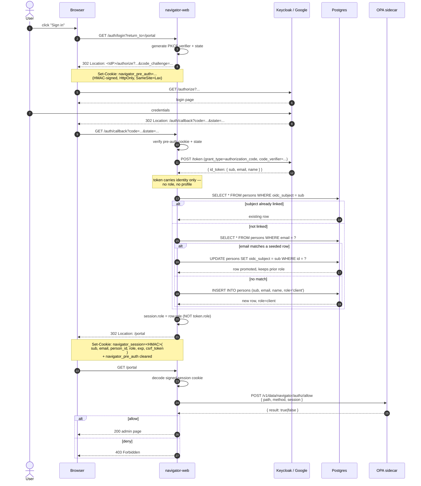
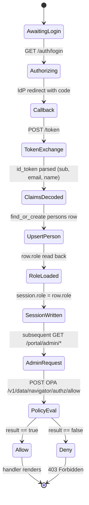

# OIDC + DB-role authorization

Neon Law Navigator separates **identity** (who you are) from **authorization** (what you can do). The OIDC provider
(Keycloak today, Google tomorrow) owns identity only — a stable `sub` and an `email`. The `persons` table in our
database owns everything else: profile, project memberships, billing relationships, and the **single role** (`client` /
`staff` / `admin`) that gates the back-office. OPA evaluates the rego policy against that DB-sourced role, never against
the IdP token. See [`docs/access-model.md`](access-model.md) for the role/participation split.

This document is the canonical narrative for the system. The Rust modules link back to it from their rustdoc:

- [`web::oauth`](../web/src/oauth.rs) — `/auth/login`, `/auth/callback`, `upsert_person_from_claims`.
  [`web::session`](../web/src/session.rs) — signed cookie shape (`SessionData`). [`web::policy`](../web/src/policy.rs) —
  `PolicyClient` and `require_policy` middleware. [`store::entity::person`](../store/src/entity/person.rs) — the
  `persons` row, including the `role` enum column. Schema migrations:
  [`m20260527_add_oidc_subject_to_persons`](../store/src/migration/m20260527_add_oidc_subject_to_persons.rs),
  [`m20260528_add_roles_to_persons`](../store/src/migration/m20260528_add_roles_to_persons.rs) (legacy `roles[]`), and
  [`m20260619_collapse_persons_roles_to_role`](../store/src/migration/m20260619_collapse_persons_roles_to_role.rs)
  (collapsed to a single `role` column).

## Login sequence

The full Authorization Code + PKCE flow, end to end, with the upsert step that links the IdP to a local `persons` row
and the OPA decision that gates the admin route.



## Identity vs authorization split

```mermaid
flowchart LR
    subgraph IdP[OIDC Provider]
        sub[sub<br/>kc-uuid-staff]
        email[email<br/>staff@neonlaw.com]
        name[name<br/>Staff]
    end
    subgraph DB[persons row]
        oidc_subject[oidc_subject<br/>kc-uuid-staff]
        local_email[email<br/>staff@neonlaw.com]
        local_name[name<br/>Staff]
        role["role<br/>staff"]
        profile[other profile<br/>columns...]
    end
    subgraph Session[signed session cookie]
        s_sub[sub]
        s_email[email]
        s_person_id[person_id]
        s_role[role &lt;-- from DB]
    end
    sub -->|id_token claim| oidc_subject
    email -->|id_token claim| local_email
    name -->|id_token claim| local_name
    oidc_subject --> s_sub
    local_email --> s_email
    role --> s_role
    profile -.->|never leaves the DB| profile
```

Two consequences fall out of this split:

1. **Granting/revoking access is one SQL statement**: `UPDATE persons SET role = 'staff' WHERE id = ?`. No IdP
   configuration change, no realm export, no new federated mapper.
2. **Replacing the IdP is an env-var swap**. The `sub` shape changes (Keycloak UUID → Google numeric string), but every
   column accepting `sub` is just `String`. See [`README.md → Swap to Google's OIDC`](../README.md). Production already
   runs this swap — `examples/deploy/k8s/gke/patches/web-env.yaml` sets `OAUTH_ISSUER_URL=https://accounts.google.com`.
   Keycloak is KIND-only and never reaches GKE.

### KIND-only: the frontchannel / backchannel split

Local Keycloak is dual-homed: Chrome hits `http://localhost:8080/keycloak/...` (KIND host port-map → nginx ingress →
Keycloak Service) and the navigator-web pod hits `http://keycloak:8080/keycloak/...` (cluster DNS, direct). One URL is
browser-reachable, the other is pod-reachable; they're not interchangeable. Keycloak v25's hostname-v2 keeps the
discovery doc honest: `KC_HOSTNAME=http://localhost:8080/keycloak` sets the frontchannel `authorization_endpoint`, and
`KC_HOSTNAME_BACKCHANNEL_DYNAMIC=true` lets `token_endpoint` and friends follow whatever URL the pod used. The OIDC
client in `web/src/oauth.rs` stays provider-agnostic — no rewrite layer needed. Production uses Google Identity Services
and never sees any of this.

## How the role enters the session



Critically, the arrow into `SessionWritten` reads from the `persons` row, not from the id_token. A token-side role, if
present, is silently ignored — the `IdTokenClaims` struct in `web::oauth` doesn't even include a `role` field.

## Local realm, client, and environment

`k8s/overlays/kind/deps/keycloak.yaml` auto-imports the `navigator` realm on startup. The fixture is intentionally
minimal — Keycloak hands us identity and nothing else (no realm-role management, no custom user attributes, no
per-product policy), so a swap target only has to give us `sub` + `email`:

- **Realm:** `navigator`.
- **Client:** `navigator-web` — confidential, Authorization Code + PKCE.
- **User:** `staff` / password `staff` (`staff@neonlaw.com`). First login prompts for a last name (the import omits it).

`web` reads its OIDC wiring from the environment. The in-cluster KIND values, written to `.devx/env`, are:

```text
OAUTH_ISSUER_URL=http://keycloak.navigator.svc.cluster.local:8080/keycloak/realms/navigator
OAUTH_CLIENT_ID=navigator-web
OAUTH_CLIENT_SECRET=<from secret>
OAUTH_REDIRECT_URI=http://localhost:3001/auth/callback   # host-runs-web mode
SESSION_SECRET=<32+ bytes, HMAC>
```

When `cargo run -p web` runs on the host rather than in-cluster, point `OAUTH_ISSUER_URL` at the browser-reachable
Keycloak URL (the ingress / host port-map, not the cluster DNS name) — see the frontchannel / backchannel split above.
Don't hand-roll these; `.devx/env` sets them correctly.

The Rust seam is three crates: `oauth2` drives the Authorization Code + PKCE state machine, `jsonwebtoken` verifies the
id_token signature against JWKS (RS256 in prod; HS256 accepted in tests only), and `reqwest` fetches the discovery doc
and JWKS with a bounded startup retry.

## Rego policy

The default policy that ships in `k8s/opa/opa.yaml`:

```rego
package navigator.authz

default allow := false

staff_tier := {"staff", "admin"}

# /portal/admin requires the DB-stamped staff (or admin) role.
allow if {
    input.path[0] == "portal"
    input.path[1] == "admin"
    input.session
    staff_tier[input.session.role]
}

# Authenticated read API.
allow if {
    input.path[0] == "api"
    input.method == "GET"
    input.session
}

# Public API documentation surfaces.
allow if {
    input.path[0] == "openapi.json"
}

allow if {
    input.path == ["api", "docs"]
}
```

`input.session.role` is whatever `persons.role` was at callback time. A user demoted to `client` in the database is
denied at their next login — no IdP coordination required.

## Verified end-to-end

`web/tests/oidc_e2e.rs` exercises the entire pipeline against a mocked Keycloak and a mocked OPA. Six tests:

1. `full_oidc_flow_upserts_person_and_passes_opa_allow` — happy path; person row created with email + name from the
   id_token.
2. `opa_deny_blocks_admin_route_with_403` — OPA returning `false` results in 403 from the admin route.
3. `second_login_with_same_subject_does_not_create_duplicate_person` — re-running the login doesn't insert a second row.
4. `user_with_db_staff_role_can_hit_every_admin_route` — pre-seeds `role = staff` in the DB, logs in (promoting the
   row), hits eight portal routes (`/portal`, `/portal/admin/people`, `/portal/admin/entities`,
   `/portal/admin/jurisdictions`, `/portal/admin/entity-types`, `/portal/admin/templates`, `/portal/admin/questions`,
   `/portal/projects`) under an OPA mock that only allows when `input.session.role == "staff"`.
5. `user_with_empty_db_roles_is_denied_even_when_token_would_have_granted` — fresh user, default `role = client`; every
   `/portal/admin/*` route returns 403.
6. `db_role_revocation_takes_effect_on_next_login` — a staff user starts with staff, succeeds; row is updated to `role =
   'client'`; next login produces a session that fails the OPA check.

Run them with:

```bash
cargo test -p web --test oidc_e2e
```

## Troubleshooting

- **`/auth/callback` returns 400 "invalid state".** Pre-auth cookie path / SameSite mismatch — the cookie set at
  `/auth/login` must be readable at `/auth/callback`. Over plain HTTP in dev that means `SameSite=Lax` + `Secure=false`.
- **JWKS fetch fails with a TLS error.** `OAUTH_ISSUER_URL` is `https` but in-cluster Keycloak is plain HTTP — set it to
  `http://…`; the spec permits it.
- **Token exchange returns `invalid_client`.** `OAUTH_CLIENT_SECRET` doesn't match the realm's client. Re-import the
  realm fixture or rotate the secret in the Keycloak admin console.
- **id_token verifies but a role claim is empty.** Expected — the session role never comes from the token; it is read
  from the `persons` row at callback time (see above). Don't add a Keycloak role mapper to work around it.

## Canonical sources

- OIDC Core 1.0: <https://openid.net/specs/openid-connect-core-1_0.html>
- OIDC Discovery 1.0: <https://openid.net/specs/openid-connect-discovery-1_0.html>
- OAuth 2.0 PKCE (RFC 7636): <https://datatracker.ietf.org/doc/html/rfc7636>
- Keycloak: <https://www.keycloak.org/documentation>
- Google Identity (OIDC): <https://developers.google.com/identity/openid-connect/openid-connect>
- `oauth2` crate: <https://docs.rs/oauth2> · `jsonwebtoken` crate: <https://docs.rs/jsonwebtoken>
