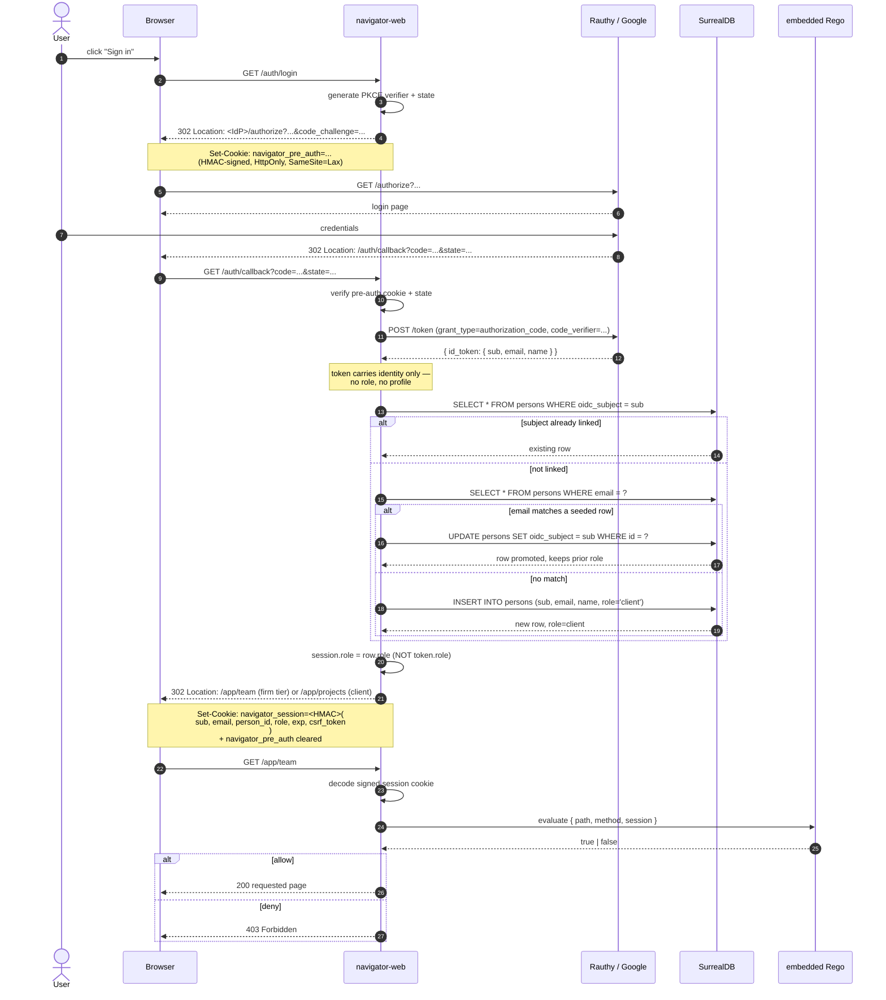
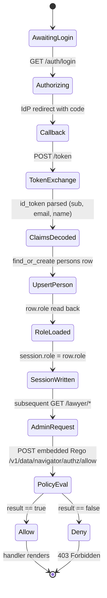

# OIDC + DB-role authorization

Neon Law Navigator separates **identity** (who you are) from **authorization** (what you can do). The OIDC provider
(Rauthy in local and staging dependency tiers, Google in production) owns identity only — a stable `sub` and an `email`.
The `persons` table in our database owns everything else: profile, project memberships, billing relationships, and the
**single role** column (`owner` / `admin` / `lawyer` / `clerk` / `client`; anonymous is the absence of a row) that gates
the back-office. Embedded Rego evaluates the policy against that DB-sourced role, never against the IdP token. See
[`docs/access-model.md`](access-model.md) for the role/participation split.

This document is the canonical narrative for the system. The Rust modules link back to it from their rustdoc:

- [`portal::oauth`](../portal/src/oauth.rs) — `/auth/login`, `/auth/callback`, `/auth/logout`, and
  `upsert_person_from_claims`. [`portal::session`](../portal/src/session.rs) — signed cookie shape (`SessionData`).
  [`portal::policy`](../portal/src/policy.rs) — `PolicyClient` and `require_policy` middleware.
  [`store::persons`](../store/src/persons.rs) — the `person` row, including the `role` field. `role` is a single string,
  not a list, and its accepted values are the schema's own ASSERT — see
  [`navigator.surql`](../store/src/schema/navigator.surql).

## Login sequence

The full Authorization Code + PKCE flow, end to end, with the upsert step that links the IdP to a local `persons` row
and the embedded Rego decision that gates the requested route.


```mermaid
sequenceDiagram
    autonumber
    actor User
    participant Browser
    participant Web as navigator-web
    participant IdP as Rauthy / Google
    participant DB as SurrealDB
    participant Policy as embedded Rego

    User->>Browser: click "Sign in"
    Browser->>Web: GET /auth/login
    Web->>Web: generate PKCE verifier + state
    Web-->>Browser: 302 Location: <IdP>/authorize?...&code_challenge=...
    Note over Web,Browser: Set-Cookie: navigator_pre_auth=...<br/>(HMAC-signed, HttpOnly, SameSite=Lax)
    Browser->>IdP: GET /authorize?...
    IdP-->>Browser: login page
    User->>IdP: credentials
    IdP-->>Browser: 302 Location: /auth/callback?code=...&state=...
    Browser->>Web: GET /auth/callback?code=...&state=...
    Web->>Web: verify pre-auth cookie + state
    Web->>IdP: POST /token (grant_type=authorization_code, code_verifier=...)
    IdP-->>Web: { id_token: { sub, email, name } }
    Note over Web: token carries identity only —<br/>no role, no profile

    Web->>DB: SELECT * FROM persons WHERE oidc_subject = sub
    alt subject already linked
        DB-->>Web: existing row
    else not linked
        Web->>DB: SELECT * FROM persons WHERE email = ?
        alt email matches a seeded row
            Web->>DB: UPDATE persons SET oidc_subject = sub WHERE id = ?
            DB-->>Web: row promoted, keeps prior role
        else no match
            Web->>DB: INSERT INTO persons (sub, email, name, role='client')
            DB-->>Web: new row, role=client
        end
    end

    Web->>Web: session.role = row.role  (NOT token.role)
    Web-->>Browser: 302 Location: /app/team (firm tier) or /app/projects (client)
    Note over Web,Browser: Set-Cookie: navigator_session=<HMAC>(<br/>  sub, email, person_id, role, exp, csrf_token<br/>)<br/>+ navigator_pre_auth cleared

    Browser->>Web: GET /app/team
    Web->>Web: decode signed session cookie
    Web->>Policy: evaluate { path, method, session }
    Policy-->>Web: true | false
    alt allow
        Web-->>Browser: 200 requested page
    else deny
        Web-->>Browser: 403 Forbidden
    end
```

## Logout sequence

`GET|POST /auth/logout` clears the app's own session — that is the whole story for the Navigator session. But clearing
our cookie leaves the *provider's* SSO session live, so the very next `/auth/login` would silently re-authenticate with
no credential prompt. To close that gap, logout performs **RP-initiated OIDC logout** (OIDC RP-Initiated Logout 1.0):
after expiring the session and pre-auth cookies, it redirects the browser to the provider's `end_session_endpoint` from
the discovery document, carrying `post_logout_redirect_uri` (the app's own origin, derived from `OAUTH_REDIRECT_URI` so
it is the same origin the login flow already round-trips through and is therefore on the provider's allowlisted
`post_logout_redirect_uris`) and `client_id` (so the provider can validate the redirect without an `id_token_hint` — the
Navigator session never retains the id_token, so there is no hint to send). The provider clears its SSO session and
bounces back to the app.

When the provider publishes no `end_session_endpoint`, logout falls back to clearing the app session and redirecting to
the app home; it never hard-fails. Rauthy's `navigator-web` client fixture allowlists `http://localhost:*` for
`post_logout_redirect_uris`, matching the host `web` origin. See
[`portal::oauth::end_session_url`](../portal/src/oauth.rs).

## Identity vs authorization split

```mermaid
flowchart LR
    subgraph IdP[OIDC Provider]
        sub[sub<br/>provider-specific string]
        email[email<br/>lawyer@neonlaw.com]
        name[name<br/>Lawyer]
    end
    subgraph DB[persons row]
        oidc_subject[oidc_subject<br/>provider-specific string]
        local_email[email<br/>lawyer@neonlaw.com]
        local_name[name<br/>Lawyer]
        role["role<br/>lawyer"]
        profile[other profile<br/>columns...]
    end
    subgraph Session[signed session cookie]
        s_sub[sub]
        s_email[email]
        s_person_id[person_id]
        s_role[role &lt;-- from DB]
    end
    sub -->|id_token claim| oidc_subject
    email -->|id_token claim| local_email
    name -->|id_token claim| local_name
    oidc_subject --> s_sub
    local_email --> s_email
    role --> s_role
    profile -.->|never leaves the DB| profile
```

Two consequences fall out of this split:

1. **Granting/revoking access is one SQL statement**: `UPDATE persons SET role = 'lawyer' WHERE id = ?`. No IdP
   configuration change, no provider-side role or claim mapper.
2. **Replacing the IdP is an env-var swap**. The `sub` shape is provider-specific, but every column accepting `sub` is
   just `String`. See [`README.md → Swap to Google's OIDC`](../README.md). Production already runs this swap —
   `examples/deploy/k8s/gke/patches/web-env.yaml` sets `OAUTH_ISSUER_URL=https://accounts.google.com`. Rauthy is
   KIND-only and never reaches GKE.

### KIND-only: one public issuer

Rauthy publishes one canonical URL for discovery, token validation, and browser redirects. Each local tier derives it
from its Rauthy port: `http://localhost:<rauthy-port>/auth/v1/`. Chrome and host-run `web` reach that URL through KIND's
NodePort mapping. A full in-cluster `navigator-web` pod reaches the identical localhost URL through its
`rauthy-loopback-proxy` sidecar, which forwards to the `rauthy` Service while preserving the public Host header.

The CLI owns the alignment. `dev up` and `worktree-env up` patch Rauthy's `PUB_URL` and `RP_ORIGIN`; `dev deploy` also
patches the sidecar listen port and the in-cluster web issuer. Re-running either command with an unchanged port is a
no-op. This avoids advertising a browser-only authorization endpoint alongside pod-only token or JWKS endpoints, and
keeps `portal/src/oauth.rs` provider-agnostic. Production uses Google Identity Services and does not load this tier.

## How the role enters the session


```mermaid
stateDiagram-v2
    [*] --> AwaitingLogin
    AwaitingLogin --> Authorizing: GET /auth/login
    Authorizing --> Callback: IdP redirect with code
    Callback --> TokenExchange: POST /token
    TokenExchange --> ClaimsDecoded: id_token parsed (sub, email, name)
    ClaimsDecoded --> UpsertPerson: find_or_create persons row
    UpsertPerson --> RoleLoaded: row.role read back
    RoleLoaded --> SessionWritten: session.role = row.role
    SessionWritten --> AdminRequest: subsequent GET /lawyer/*
    AdminRequest --> PolicyEval: POST embedded Rego /v1/data/navigator/authz/allow
    PolicyEval --> Allow: result == true
    PolicyEval --> Deny: result == false
    Allow --> [*]: handler renders
    Deny --> [*]: 403 Forbidden
```

Critically, the arrow into `SessionWritten` reads from the `persons` row, not from the id_token. A token-side role, if
present, is silently ignored — the `IdTokenClaims` struct in `portal::oauth` doesn't even include a `role` field.

## Local fixture, client, and environment

[`k8s/staging/rauthy.yaml`](../k8s/staging/rauthy.yaml) is the reusable deployment layer. It contains no bootstrap
credentials or client registration: an environment must supply `rauthy-secrets`, `rauthy-client`, and
`rauthy-bootstrap`, so a staging deployment without environment-owned values fails closed.

The KIND-only fixture at [`k8s/overlays/kind/rauthy/local-fixture.yaml`](../k8s/overlays/kind/rauthy/local-fixture.yaml)
supplies:

- **Client:** `navigator-web` — confidential Authorization Code flow, `S256` PKCE, RS256 id/access tokens, and loopback
  wildcard redirect, logout, and origin URLs for isolated worktree ports.
- **Role accounts:** `owner@neonlaw.com`, `admin@neonlaw.com`, `lawyer@neonlaw.com`, `clerk@neonlaw.com`, and
  `client@neonlaw.com`, each with password `password` and each carrying the matching app role. All five share one seeded
  demo matter, *Simpson v. Flanders* (project code `simpsons`), so each role can be exercised on the same project.
- **Rauthy administrator:** `nick@neonlaw.com` / `admin`, with the admin surface at
  `http://localhost:<rauthy-port>/auth/v1/admin`.

Rauthy has one full administrator rather than a realm-scoped `manage-users` administrator. The known password is
acceptable only in the loopback-bound KIND fixture; never promote that Secret into a shared environment.

`web` reads its OIDC wiring from the environment. The in-cluster KIND values, written to `.devx/env`, are:

```text
OAUTH_ISSUER_URL=http://localhost:30080/auth/v1/
OAUTH_CLIENT_ID=navigator-web
OAUTH_CLIENT_SECRET=<64-byte KIND fixture secret>
OAUTH_REDIRECT_URI=http://localhost:3001/auth/callback   # host-runs-web mode
SESSION_SECRET=<32+ bytes, HMAC>
```

Do not hand-roll worktree values. `.devx/env` uses that worktree's selected Rauthy and web ports. The full in-cluster
deployment uses the same issuer through the pod-local loopback bridge described above.

The Rust seam is three crates: `oauth2` drives the Authorization Code + PKCE state machine, `jsonwebtoken` verifies the
id_token signature against JWKS (RS256 in prod; HS256 accepted in tests only), and `reqwest` fetches the discovery doc
and JWKS with a bounded startup retry.

## Authorization is decided elsewhere

OIDC supplies *identity* — who the caller is, stamped into the session at callback time. It does not decide
*authorization*. Navigator compiles and evaluates its Rego policy in process from `portal/policy/navigator.rego`. For
decision semantics (admin bypass, lawyer-tier writes, project-scoped reads), see
[`docs/access-model.md`](access-model.md#how-embedded-rego-decides); for runtime and Rego authoring, see
[`docs/rego-policy.md`](rego-policy.md). The one identity fact that matters here: `input.session.role` is whatever
`persons.role` was at callback time, so a user demoted to `client` in the database is denied at their next login — no
IdP coordination required.

## Admin client impersonation

Navigator's admin impersonation is modeled after OAuth 2.0 Token Exchange's actor/subject split, not after IdP-side role
mapping. During impersonation, the browser's signed `SessionData` changes its effective top-level identity to the target
client person (`sub`, `email`, `person_id`, `role = client`) and carries an `impersonation` actor block with the admin
who initiated it. That mirrors the RFC 8693 shape where the token's top-level subject is the represented user and the
`act` claim identifies the current actor.

The practical rules are:

1. Only an `admin` session may start impersonation.
2. The target must be a `client` person. Owner and Admin cannot impersonate Clerk, Lawyer, Admin, or Owner.
3. Embedded Rego and route-layer project visibility evaluate the effective client session, so portal reads use the same
   client ACLs as a real client login.
4. Every shared-layout page renders a persistent impersonation banner with the target name/email and a POST-only exit
   control.
5. Exiting impersonation reloads the admin actor's `persons` row before restoring the session, so a demotion during an
   impersonation window is honored immediately.

This is still application-session impersonation, not a Rauthy-specific feature. Rauthy remains a KIND-only identity
provider and production may use Google OIDC; both only need to provide the login identity. The DB-owned `persons.role`
and signed Navigator session own the impersonation state.

## Verified end-to-end

`server/tests/oidc_e2e.rs` exercises the entire pipeline against a mocked OIDC provider and the compiled production
policy. Six tests:

1. `full_oidc_flow_upserts_person_and_allows_lawyer` — happy path; person row created with email + name from the
   id_token.
2. `embedded_policy_denies_client_admin_route_with_403` — the compiled policy denies a Client-tier caller with 403.
3. `second_login_with_same_subject_does_not_create_duplicate_person` — re-running the login doesn't insert a second row.
4. `user_with_db_lawyer_role_can_hit_every_admin_route` — pre-seeds `role = lawyer` in the DB, logs in (promoting the
   row), hits eight app routes (`/app/lawyer`, `/lawyer/people`, `/lawyer/entities`, `/lawyer/jurisdictions`,
   `/lawyer/entity-types`, `/lawyer/templates`, `/lawyer/questions`, `/app/projects`) using the production policy.
5. `user_with_empty_db_roles_is_denied_even_when_token_would_have_granted` — fresh user, default `role = client`; every
   `/lawyer/*` route returns 403.
6. `db_role_revocation_takes_effect_on_next_login` — a lawyer user starts with lawyer, succeeds; row is updated to `role
   = 'client'`; next login produces a session that fails the embedded Rego check.

Run them with:

```bash
cargo test -p server --test oidc_e2e
```

## Troubleshooting

- **`/auth/callback` returns 400 "invalid state".** Pre-auth cookie path / SameSite mismatch — the cookie set at
  `/auth/login` must be readable at `/auth/callback`. Over plain HTTP in dev that means `SameSite=Lax` + `Secure=false`.
- **JWKS fetch fails with a TLS error.** `OAUTH_ISSUER_URL` is `https` but in-cluster Rauthy is plain HTTP — set it to
  `http://…`; the spec permits it.
- **Token exchange returns `invalid_client`.** `OAUTH_CLIENT_SECRET` does not match the bootstrapped `navigator-web`
  client. Reconcile the environment-owned `rauthy-client` Secret and client registration.
- **id_token verifies but a role claim is empty.** Expected — the session role never comes from the token; it is read
  from the `persons` row at callback time (see above). Don't add a Rauthy role mapper to work around it.

## Canonical sources

- OIDC Core 1.0: <https://openid.net/specs/openid-connect-core-1_0.html>
- OIDC Discovery 1.0: <https://openid.net/specs/openid-connect-discovery-1_0.html>
- OIDC RP-Initiated Logout 1.0: <https://openid.net/specs/openid-connect-rpinitiated-1_0.html>
- OAuth 2.0 PKCE (RFC 7636): <https://datatracker.ietf.org/doc/html/rfc7636>
- Rauthy: <https://sebadob.github.io/rauthy/>
- Google Identity (OIDC): <https://developers.google.com/identity/openid-connect/openid-connect>
- `oauth2` crate: <https://docs.rs/oauth2> · `jsonwebtoken` crate: <https://docs.rs/jsonwebtoken>
