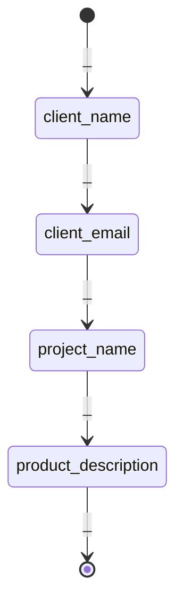
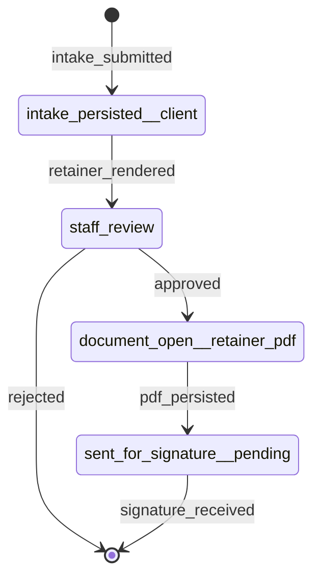
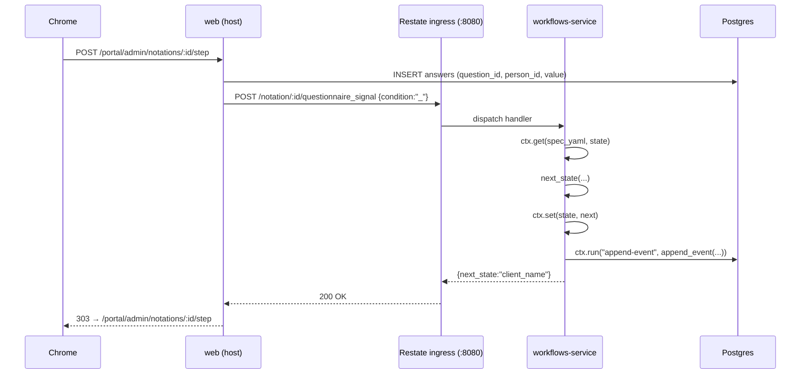

# Retainer intake walkthrough

The retainer-intake flow is a pair of durable state machines per [Notation](notation.md#notation), declared in the
frontmatter of [`notation_templates/neon_law/shared/retainer.md`](../notation_templates/neon_law/shared/retainer.md) and
walked by the [`web::retainer_walk`](../web/src/retainer_walk.rs) module:

1. **Questionnaire walker** — one question per request, one [Answer](notation.md#answer) per advance, one
   [Notation Event](glossary.md#notation-event) per transition. Walks the state chain `BEGIN` → `client_name` →
   `client_email` → `project_name` → `product_description` → `END`.
2. **Post-intake workflow** — fires once the questionnaire reaches `END`. Walks `intake_persisted__client` →
   `staff_review` → `document_open__retainer_pdf` → `sent_for_signature__pending` → `END`, driving render, PDF
   persistence, and "sent for signature".

Both timelines share the same runtime surface ([`workflows::StateMachineRuntime`](../workflows/src/runtime.rs)), keyed
by `(MachineKind, notation_id)`, and run as a single [Restate](glossary.md#restate) virtual object per Notation. The
worker that hosts the object lives in [`workflows-service/`](../workflows-service/).

## Questionnaire state machine



The bare `_` condition is the only signal that advances a questionnaire (the canonical "respondent answered"). State
names are bare question codes — no `__discriminator` suffix — because a questionnaire only ever asks one respondent.

## Post-intake workflow



State names use the `<prefix>__<discriminator>` form so [`workflows::step_kind_for`](../workflows/src/step.rs) can pick
the right actor class (system / staff / respondent) per state.

## HTTP surface

Four routes, all under [`web::retainer_walk`](../web/src/retainer_walk.rs):

- `GET /portal/admin/retainers/new` — render the "start a walk" form.
- `POST /portal/admin/retainers/new` — find-or-insert person, then insert project + role + notation in one
  transaction; redirect to `/portal/admin/notations/:id/step`.
- `GET /portal/admin/notations/:id/step` — render the current question, or redirect once the questionnaire reaches
  `END`.
- `POST /portal/admin/notations/:id/step` — persist the answer, signal the runtime, advance the walker — or, on
  `END`, drive the post-intake workflow (render → send for signature).

Every state-changing request carries a CSRF token; auth is enforced by the `require_auth` layer on the admin router.

## One POST through the stack

What a single `POST /portal/admin/notations/:id/step` looks like when `RESTATE_BROKER_URL` is set (the in-cluster
`restate` Service in KIND, or the GKE-managed broker in production):



The two `pg` arrows have two different writers: the walker writes [Answers](notation.md#answer) directly; the worker is
the sole writer of [Notation Events](glossary.md#notation-event), inside [`ctx.run`](glossary.md#ctxrun) so a crash +
replay reuses the cached row id instead of double-inserting.

## Persistence

**[Restate](glossary.md#restate) is the source of truth for state; the `notation_events` table is the durable projection
of that state.** A signal lands in Restate's keyed state first; the Postgres row is the worker's `ctx.run` side effect,
journaled so a replay never double-writes.

Each transition is recorded as one row in `notation_events`
([`store::entity::notation_event`](../store/src/entity/notation_event.rs)), the append-only journal that mirrors
[`workflows::WorkflowEvent`](../workflows/src/runtime.rs). The "current state" of a `(notation_id, machine_kind)`
machine is the `to_state` of the latest row — see [`latest_for_kind`](../store/src/entity/notation_event.rs). For a
questionnaire signal, the `payload` column carries `{"answer_value": "…"}`; for a workflow signal it is `None`.

Answers themselves are stored in the `answers` table, keyed by `(question_id, person_id)`. The walker pre-fills the
prior answer when the user navigates back so re-display is read-only.

## Durable execution

Restate is the production target. The [`workflows-service`](../workflows-service/) crate registers a `Notation` virtual
object with the broker; each `questionnaire_signal` and `workflow_signal` handler reads the spec yaml + current state
from Restate's keyed state, computes the next state, persists it back, and appends one row to `notation_events` inside
`ctx.run("append-event", …)` so a replay reuses the cached row id instead of double-writing.

The application-side adapter ([`workflows::runtime_restate::RestateRuntime`](../workflows/src/runtime_restate.rs)) posts
to the broker's ingress port. When `RESTATE_BROKER_URL` is unset, `web` falls back to the in-process
[`InMemoryRuntime`](../workflows/src/runtime.rs) used in tests and local dev.

## The signature seam

[`web::signature::SignatureProvider`](../web/src/signature.rs) is a one-method async trait:

```rust
#[async_trait]
pub trait SignatureProvider: Send + Sync {
    async fn send_for_signature(
        &self,
        notation_id: i32,
        pdf: &[u8],
    ) -> Result<SignatureRequestId, SignatureError>;
}
```

Google Workspace eSignature **has no public API** today (it is a UI-only feature inside Docs / Drive — see Google's own
docs), so the shipped implementation is `StubSignatureProvider`, which records every call to an internal
`Mutex<Vec<…>>`. Tests assert on it; dev runs against it. A real DocuSign or Dropbox Sign adapter implements the same
trait and is plugged in by swapping the `Arc<dyn SignatureProvider>` in [`web::AppState`](../web/src/lib.rs).

## Test coverage

- **Spec shape**: [`workflows/tests/retainer_intake_spec.rs`](../workflows/tests/retainer_intake_spec.rs) parses the
  YAML and drives the spec end-to-end on `InMemoryRuntime`.
- **Walker progress**: unit tests in [`web/src/retainer_walk.rs`](../web/src/retainer_walk.rs) cover `progress_for`
  across BEGIN, mid-walk, and the last-question cap.
- **View components**: unit tests in [`views/src/pages/admin/retainers.rs`](../views/src/pages/admin/retainers.rs) cover
  `StartWalk`, `QuestionStep` (string / text / int / bool branches, prior-answer pre-fill, CSRF), and `IntakeResult`.
- **Restate adapter**: [`workflows/src/runtime_restate.rs`](../workflows/src/runtime_restate.rs) uses `wiremock` to pin
  the broker wire shape per `MachineKind`.
- **Worker handlers**: [`workflows-service/src/notation_service.rs`](../workflows-service/src/notation_service.rs) pins
  `next_state` against the questionnaire spec; the journal helpers live next door in
  [`workflows-service/src/journal.rs`](../workflows-service/src/journal.rs).
- **HTTP + browser**: [`web/tests/browser_e2e.rs`](../web/tests/browser_e2e.rs) drives the full retainer walk end-to-end
  via fantoccini + chromedriver.
