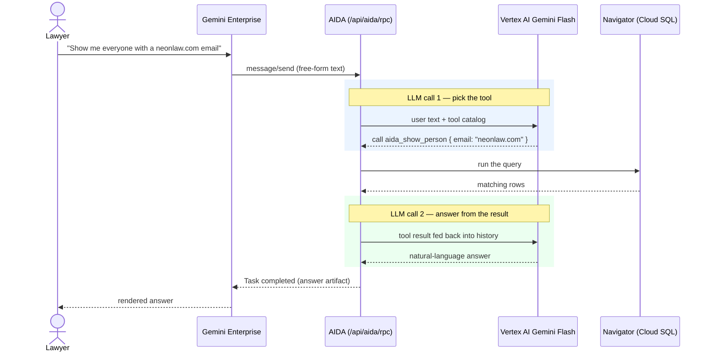

# mcp

[Model Context Protocol](https://modelcontextprotocol.io/) tool catalog for Neon Law Navigator — AIDA's tools. Today the
catalog is surfaced to **[Google Gemini Enterprise](https://cloud.google.com/gemini-enterprise)** over **A2A**
(Agent2Agent), so a lawyer can operate on Neon Law Navigator data from the Gemini chat box with no install and no CLI.

This page is the A2A-with-Gemini story: how you query AIDA, and what happens on each turn. The one-time wiring (agent
card, OAuth, registration) lives in [gemini-enterprise-mcp.md](../docs/gemini-enterprise-mcp.md); the runtime model —
where AIDA pauses for a yes/no authorization and how a failure's reason reaches you — lives in
[aida-a2a-interaction.md](../docs/aida-a2a-interaction.md).

## How Gemini Enterprise reaches AIDA

AIDA publishes a public **agent card** at `GET /api/aida.json` — her name, skills, transport, and security schemes. A
lawyer adds AIDA once through Gemini's "Add AIDA" connector by pasting that card URL; from then on every chat message is
a JSON-RPC `message/send` to `POST /api/aida/rpc`, authenticated with the same Google Workspace identity that signs into
the portal. No new identity provider, no per-tool configuration.

## How to query

You ask in plain English. AIDA maps the request to one of her tools and runs it — you never name a tool yourself.

| Ask for… | Example prompt | Tool AIDA runs |
| --- | --- | --- |
| Add a person | "Add Maya Patel, maya@example.com, to the CRM." | `aida_create_person` |
| Look someone up | "Show me everyone with a neonlaw.com email." | `aida_show_person` |
| List jurisdictions | "What states can we organize an entity in?" | `aida_list_jurisdictions` |
| Start a notation | "Start a retainer for maya@example.com." | `aida_create_notation` |
| Answer a notation | (AIDA asks the next question; you answer in chat) | `aida_answer_notation` |
| Lint a notation body | "Validate this markdown notation." | `aida_validate_notation` |

Two rules worth knowing before you start:

- **Reads run; writes wait.** A lookup runs immediately. A side-effecting act — creating a person, sending a welcome
  email, starting a notation — pauses for a one-tap **yes/no** authorization, because a licensed human must supervise a
  client-facing act. Reply `yes` to authorize or `no` to cancel.
- **Errors come back as text.** When a call fails, the reason shows in the chat so you can correct the input and ask
  again, instead of seeing a blank non-result.

The catalog is small by design — many small, obviously-safe tools rather than a general database adapter. The source of
truth is [`src/tools/mod.rs`](src/tools/mod.rs): `list_tools()` (what's advertised) and the `call_tool` match (what's
dispatched). Every tool name starts with the required `aida_` prefix so it stays grouped in a multi-server client.

## Two LLM calls per query

A free-form ask is answered with **two** Gemini calls around one tool run. The first call decides *which* tool to call;
AIDA runs it (the query against the same Cloud SQL database the portal reads); the second call turns the result into the
natural-language answer you see. The router is Vertex AI Gemini Flash in production (a `NullRouter` in local dev points
callers at the `metadata.skill` backdoor instead).

For a side-effecting request the first call still picks the tool, but AIDA returns an `input-required` task and waits
for your `yes` before the tool runs — the confirmation gate described in
[aida-a2a-interaction.md](../docs/aida-a2a-interaction.md).

## Shape

`mcp` is a **library crate**; there is no `mcp` binary. The same catalog also rides the Model Context Protocol on the
`/mcp` endpoint, and [`web::a2a`](../web/src/a2a.rs) bridges both surfaces so A2A and MCP share one tool registry. In
production both endpoints sit on the `web` pod behind the same auth stack (Google OAuth → OPA), on the same Cloud SQL
connection the public site uses.
