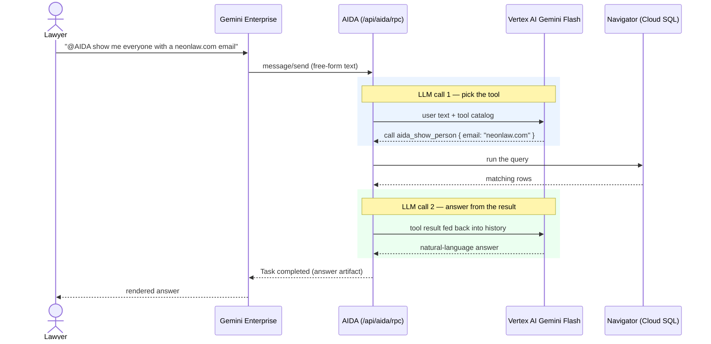

# mcp

**AIDA** is Neon Law Navigator's agent. In [Google Gemini Enterprise](https://cloud.google.com/gemini-enterprise) you
tag `@AIDA` and ask, in plain English, to work with the firm's data — look someone up, add a client, start a retainer —
with no install and no CLI.

## Use @AIDA in Google Gemini Enterprise

A lawyer adds AIDA once through Gemini Enterprise's "Add AIDA" connector, then talks to her in the ordinary chat box.
Every request is plain language: AIDA works out which of her tools answers it, runs that tool against the same database
the portal reads, and replies. You never name a tool or write code.

### What you can ask

Some of what you can ask for today — phrase it however you like; the examples are just illustrative:

| Ask for… | Example prompt | What AIDA does |
| --- | --- | --- |
| Add a person | "Add Maya Patel, maya@example.com, to the CRM." | Creates the person record. |
| Look someone up | "Show me everyone with a neonlaw.com email." | Finds matching people. |
| List jurisdictions | "What states can we organize an entity in?" | Lists every jurisdiction. |
| Start a notation | "Start a retainer for maya@example.com." | Begins the questionnaire. |
| Answer a notation | (AIDA asks the next question; you answer in chat) | Records the answer, asks the next. |
| Check a notation body | "Validate this markdown notation." | Lints it and reports problems. |

### AIDA confirms before she acts

- **Reads happen right away; changes wait for your yes.** A lookup runs immediately. Anything that writes data or
  reaches a client — adding a person, sending a welcome email, starting a retainer — pauses for a one-tap **yes/no**
  first, because a licensed person has to authorize a client-facing act. Reply `yes` to go ahead or `no` to cancel.
- **If something fails, AIDA says why.** The reason comes back in the chat, so you can fix the input and ask again
  instead of staring at a blank non-result.

## Under the hood

*For the technically minded.* AIDA is reached the same way on any host that speaks the protocols — **A2A first, then
MCP**, over one tool catalog. Gemini Enterprise's "Add AIDA" connector is one such host.

**A2A (Agent2Agent).** A host learns about AIDA from her public **agent card** at `GET /api/aida.json` — name, skills,
transport, security schemes — then sends each chat message as a JSON-RPC `message/send` to `POST /api/aida/rpc`,
authenticated with the same Google Workspace identity that signs into the portal. No new identity provider, no per-tool
setup.

**MCP (Model Context Protocol).** The catalog also speaks [MCP](https://modelcontextprotocol.io/) at `POST /mcp`, and
[`web::a2a`](../web/src/a2a.rs) bridges the two so A2A and MCP share one registry
([`src/tools/mod.rs`](src/tools/mod.rs)). Every tool name carries the `aida_` prefix so it stays grouped in a
multi-server client. Both endpoints sit on the `web` pod behind the same auth stack (Google OAuth → OPA), on the same
Cloud SQL connection the public site uses.

### How a query runs — two model calls

Behind a single plain-English ask are **two** model calls around one tool run. The first decides *which* tool to call;
AIDA runs it (the query against Cloud SQL); the second turns the result into the answer you read. The router is Vertex
AI Gemini Flash in production (a `NullRouter` in local dev points callers at the `metadata.skill` backdoor instead).

For a request that changes data the first call still picks the tool, but AIDA returns an `input-required` task and waits
for your `yes` before the tool runs — the confirmation gate described in
[aida-a2a-interaction.md](../docs/aida-a2a-interaction.md). The one-time wiring (agent card, OAuth, registration) lives
in [gemini-enterprise-mcp.md](../docs/gemini-enterprise-mcp.md).
